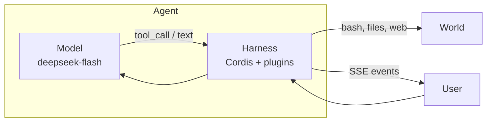

# 01 · The harness

An **agent** is a model plus a harness. The model chooses words and tool
calls. The harness is everything else: history, tools, permissions, a
place to run bash, a log that survives a crash.

Official DeepSeek Harness says the same thing as a formula:

```text
Agent = Model + Harness
Harness = kernel + plugins
```

The **kernel** here is Cordis 4.x (`@deepseek-ai/cordis`). Everything is a
plugin. A tool is a plugin. The agent loop is a plugin. Settings are a
plugin. That is not a metaphor; it is how `composeHarness()` is written.



## Why this is not the official CLI

`npx @deepseek-ai/dsh` is a Node process. It has a YAML Loader, HMR, a
PTY, `dsh plugin add`, and a Web GUI that talks Typert RPC. None of that
fits in a Cloudflare Worker isolate:

| Official DSH assumes | Worker isolate has |
|---|---|
| `node:` APIs, child processes | `fetch`, Web Crypto, streams, DO SQL |
| A process that stays up | Hibernation; memory is gone |
| PTY and long-lived jobs | One-shot `exec` in a container |
| Module Loader for the official frontend | Assets SPA over `/api` |

So this port keeps the **kernel** and reimplements the **host**. Linux
moves to a container. The session log becomes SQLite. The GUI is two
static apps. That split is [chapter 02](02-system-map.md).

## What “teaching host” means

The port is meant to be readable. You can follow one identity from
cookie to `getByName` to `agentLoop.run`. It is not a marketplace, not
`chat.deepseek.com`, and not a drop-in for every official plugin.

Things that *do* run here: sessions, DeepSeek V4.1 Flash with thinking
and tools, web search/fetch, Linux under `/workspace`, skills, one-shot
subagents, todos, schedule, plan mode, ask-user, permissions.

Things that do **not**: [core-gaps.md](../../core-gaps.md).

## The model

Default model is **DeepSeek V4.1 Flash**, id `deepseek-flash`, at
`https://api.deepseek.com/chat/completions`. Override with
`DEEPSEEK_MODEL`. The key stays on the server. The browser never sees it.

The model is not the architecture. Swap the adapter (`ctx.llm`) and the
loop still logs events the same way.

Next: [System map](02-system-map.md).
