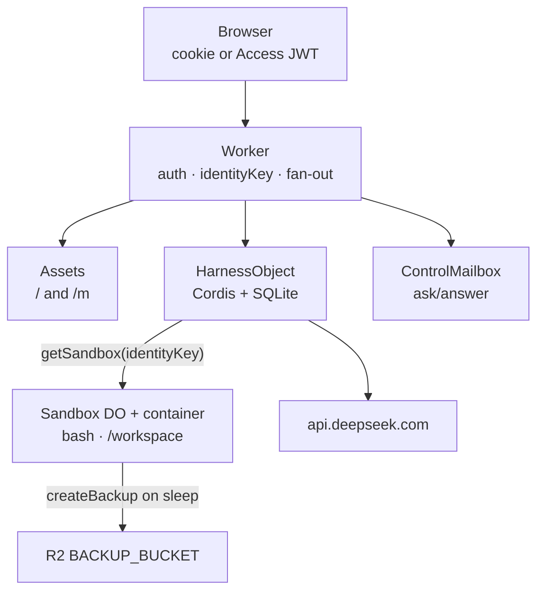
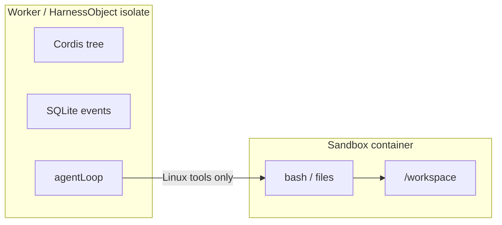

# 02 · System map

Five Cloudflare products, one Worker script, three Durable Objects. The
Worker is required because Access, Assets, Durable Objects, Containers,
and R2 cannot bind each other.

## Who owns what

| Product | Job |
|---|---|
| Worker | HTTP entry, auth, `identityKey()`, `getByName` |
| Workers Assets | Desktop `/`, chat `/m`, `run_worker_first` |
| `HarnessObject` | Plugin tree, session log, agent loop |
| `ControlMailbox` | In-memory waiters for `ask_user_question` |
| `Sandbox` | Official `@cloudflare/sandbox` container |
| R2 | `/workspace` snapshot on idle sleep |
| Access (optional) | Who may hit the hostname |

The browser never picks a Durable Object id. After auth, the Worker
calls `getByName(identityKey())` for Harness, Mailbox, and Sandbox
together. That is the whole tenancy model until you flip
`IDENTITY_MODE=per-user`.

## Isolate versus container

The loop, the log, and the model HTTP all stay in the isolate. Bash and
the project directory stay in the container. Hibernation drops the
in-memory Cordis tree. The next request calls `composeHarness()` again
and rebuilds model history from the append-only `events` table.

`nodejs_compat` is on because the official Sandbox wrangler template
needs it. Plugins still must not import `node:`.

## Request paths

| Path | Lands on |
|---|---|
| `GET /`, `/m`, static | Assets; Worker may 302 `/` → `/m` |
| `POST /api/login` | Worker (disabled if Access is configured) |
| `POST /api/sessions/:id/answer` | ControlMailbox |
| other `/api/*` | `HarnessObject.fetch` |

Full route table: [`web.md`](../../web.md). Identity: [chapter 03](03-identity.md).
