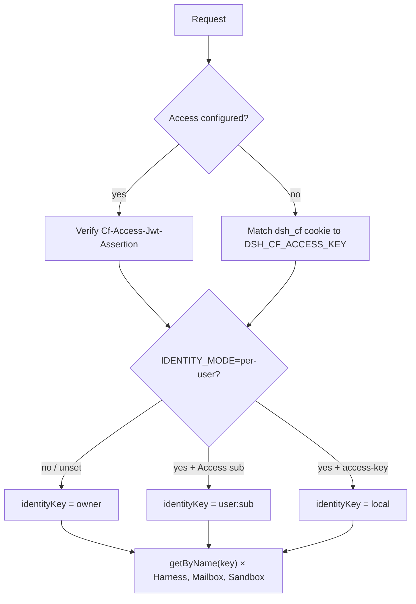

# 03 · Identity

Identity is a string. It is the Durable Object name. It is not an email.

## Two gates

They are mutually exclusive.

**Access key (default).** `TEAM_DOMAIN` and `POLICY_AUD` unset.
`POST /api/login` accepts `DSH_CF_ACCESS_KEY` and sets `dsh_cf`
(HttpOnly, SameSite=Lax, Secure on HTTPS). This is `wrangler dev` and a
public `workers.dev` until Access exists.

**Cloudflare Access.** Secrets `TEAM_DOMAIN` and `POLICY_AUD` set. The
Worker verifies `Cf-Access-Jwt-Assertion` against the team JWKS. It
never trusts `Cf-Access-Authenticated-User-Email`. `/api/login` returns
400.

Access decides **who may use the hostname**. Tenant routing is still
`identityKey()`.

## Modes

| Mode | Access JWT | Access key |
|---|---|---|
| unset / `shared-owner` | `"owner"` | `"owner"` |
| `per-user` | `user:` | `"local"` |

Default production is **one sandbox and one SQLite** for everyone who
can log in. That is intentional for a teaching host. Flip
`IDENTITY_MODE=per-user` only after Access is on and you accept
`max_instances: 5` as a cap on **running** containers, not on
registered users.

Email is display-only (`GET /api/me`). The SPA does not send
`identityKey` back and does not offer a tenant picker.

Optional `LEGACY_OWNER_SUB` / `LEGACY_OWNER_EMAIL` keep one principal
on the old `"owner"` object when you flip. Rollback: unset
`IDENTITY_MODE` and redeploy. Unused `user:*` objects hibernate; they
are not copied back.

Next: [A turn](04-turn.md).
