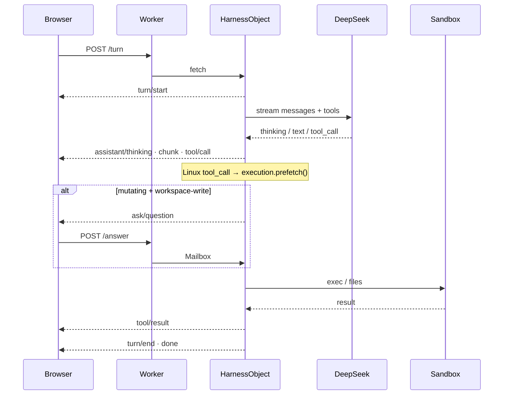

# 04 · A turn

A turn is `POST /api/sessions/:id/turn` with a message. The Worker
forwards it to `HarnessObject`. The object streams SSE until `done`.

## The log is the truth

Every event is appended to SQLite: `turn/start`, `user/message`,
`assistant/thinking`, `assistant/chunk`, `assistant/message`,
`tool/call`, `tool/result`, `ask/question`, `ask/answer`, `turn/end`.

The model does **not** see an ad-hoc array. It sees
`session.deriveMessages()`, which projects those events into Chat
messages and skips ranges covered by `compaction/summary`. After
hibernation the isolate is empty; the next compose rebuilds from the
log. That matches upstream DeepSeek Harness: **model-visible facts are
logged events**.

History replay in the SPA uses **settled** events (`assistant/message`,
tools), not live `assistant/chunk` rows, so a refresh does not
duplicate streamed text.

## Loop shape

`AgentLoop` caps a turn at **24** steps. Each step:

1. Assemble system prompt + `deriveMessages()`
2. Stream the model
3. If there are no tool calls, emit the assistant message and stop
4. Else execute each tool (permissions first), emit `tool/result`, next step

Linux tool names (`bash`, `read_file`, `write_file`, `list_dir`,
`mkdir`, `delete_file`, `glob`, `grep`, `str_replace_editor`) trigger
`execution.prefetch()` as soon as the `tool_call` delta arrives, so
container wake overlaps the rest of the stream and any Allow prompt.

## Permissions

| Preset | Mutating Linux tools |
|---|---|
| `workspace-write` (default) | Ask Allow / Deny (5 minute wait) |
| `danger-full-access` | Do not ask |

Reads, glob, grep, and `str_replace_editor` `view` do not mutate. Plan
mode refuses mutating tools until you exit plan. Linux is always inside
Sandbox `/workspace`, even in danger-full-access.

`ask_user_question` waiters live on `ControlMailbox` because the
HarnessObject may hibernate while the UI is thinking. The turn’s
`AbortSignal` stays in the harness isolate. Turns waiting on ask-user
are **not** resumed across hibernation.

Next: [Plugins](05-plugins.md).
