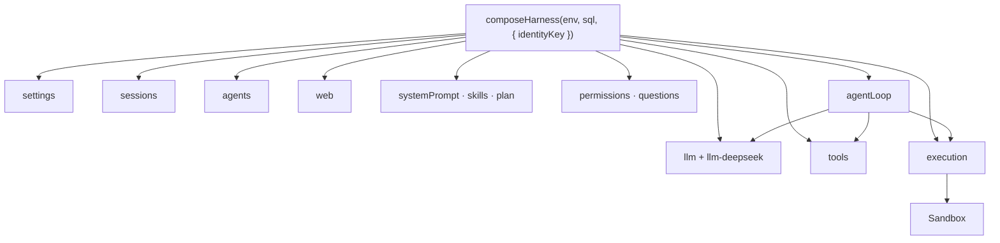

# 05 · Plugins

Cordis: everything is a plugin. This host does not reimplement a kernel.
`composeHarness()` mounts services onto a `Context`. Third-party plugins
use the same shapes official DSH uses (`apply`, `inject`,
`ctx.tools.register`). They must not import `node:`. There is no YAML
Loader and no `dsh plugin add`.



## Seams you should use

| Service | For |
|---|---|
| `ctx.sessions` | Append-only log, `deriveMessages()`, `fork()`, `remove()` |
| `ctx.agents` | Live Agent handles (`id === session.id`) |
| `ctx.llm` | `stream` / `complete`; `registerAdapter` for another model |
| `ctx.web` | Search / fetch providers |
| `ctx.tools` | Model-facing tools; unwind with the fiber |
| `ctx.systemPrompt` | Ordered `section({ name, order, text })` |
| `ctx.commands` | Slash commands |
| `ctx.execution` | Linux. Do not talk to the container yourself |
| `ctx.permissions` | Ask before mutate |
| `ctx.schedule` | Alarms via `armAlarm` |

Minimal plugin:

```ts
import type { Context } from "@deepseek-ai/cordis"

export const name = "acme"
export const inject = ["tools", "systemPrompt"]

export function apply(ctx: Context) {
  ctx.tools.register({
    name: "acme_lookup",
    description: "Look up an Acme record",
    parameters: {
      type: "object",
      properties: { id: { type: "string" } },
      required: ["id"],
    },
    async execute(args) {
      return JSON.stringify({ id: args.id })
    },
  })
}
```

Mount from `composeHarness(..., { plugins: [acme] })` or add the module
in `src/compose.ts`. Registrations unwind when the fiber ends.

Full seams: [`plugins.md`](../../plugins.md).

Next: [Linux sandbox](06-sandbox.md).
