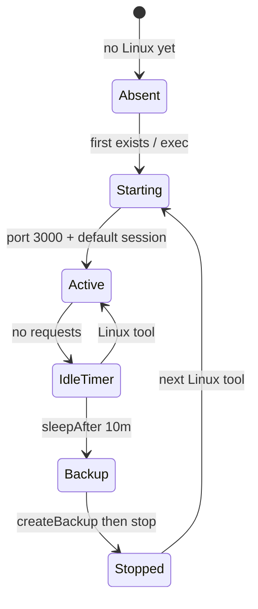

# 06 · Linux sandbox

Linux is the official Cloudflare Sandbox SDK
(`@cloudflare/sandbox@0.12.9`), the same split official DSH uses for
E2B. The harness loop never sees a shell. `ExecutionService` calls
`getSandbox(env.Sandbox, identityKey, { sleepAfter: "10m" })`.

## What we use

| Piece | Value |
|---|---|
| Image | `FROM docker.io/cloudflare/sandbox:0.12.9` |
| Instance | `basic` — 1 GiB, ¼ vCPU, 4 GB disk |
| `max_instances` | 5 **running** containers |
| Sleep | `sleepAfter = "10m"`, `keepAlive` left false |
| Client | `exec`, `readFile`, `writeFile`, `listFiles`, `mkdir`, `deleteFile` |

Login, session list, and a chat-only turn do **not** start the
container. Research tools (`web_search`, `web_fetch`) do not either.

## Isolation

The container is the isolation boundary. There is no Landlock policy in
the Worker. Even `danger-full-access` cannot see the host filesystem.
Paths are resolved under `/workspace`; escapes throw.

`AbortSignal` is not RPC-serializable. `sandbox.exec` uses a 120s
timeout instead of forwarding the browser abort.

## Capacity

A start that exceeds `max_instances` fails Linux tools with a stable
string: sandbox capacity reached; retry when another workspace sleeps.
Sleeping sandboxes do not occupy a slot. Shared-owner `"owner"` is one
slot for the whole teaching host.

Cloudflare can SIGTERM a running instance for platform reasons. Do not
treat a live container as a permanent machine.

Next: [Persistence](07-persistence.md).
