# 08 · Latency

Cloudflare’s FAQ quotes container cold starts in the **1–3 second**
range for small Go/Node hello-world images. This host is not that
image. Production probe, 2026-09-13, `maa05`, `cloudflare/sandbox:0.12.9`
on `basic`, after an explicit `stop()`:

```mermaid
gantt
  title Sleep-wake boot (ms)
  dateFormat X
  axisFormat %s
  section Boot
  load handle           :a, 0, 13
  wake container        :b, 13, 8768
  unsquashfs restore    :c, 8768, 10056
  section Exec
  uname                 :d, 10056, 10114
```

| Step | ms | What |
|---:|---:|---|
| Handle | 13 | DO `loadWorkspaceBackup()` |
| **Wake** | **8768** | First container RPC: provision + port 3000 + default session |
| **Restore** | **1288** | `localBucket` extract of `/workspace` |
| Ensure | 0 | skipped on restore hit |
| `uname` | 58 | after the box is up |
| **Boot total** | **~10056** | |

Warm path, same isolate: boot **0ms**, `uname` **~55ms**. A chat turn
after `stop()`: DeepSeek to first `tool_call` **~2.1s**; `tool_call` to
`tool/result` **~7.7s**. Prefetch starts at the Linux `tool_call`, so
wake overlaps the remainder of the stream — not the 2s of model time
before the name is known.

## Why ~9s of wake

The official image is Debian + Node + Bun + sandbox control plane
(inspect ~225MB, Docker reports ~850MB virtual). Cloudflare pre-fetches
images; sleep-wake is still 8.8s, so this is **not a pull**. It is
entrypoint on **¼ vCPU**. The image sets `JAVASCRIPT_POOL_MIN_SIZE=3`
and `TYPESCRIPT_POOL_MIN_SIZE=3`. Replacing it with Alpine would break
the SDK.

## What we will not do by default

| Idea | Why not |
|---|---|
| Prefetch on every user message | Hides ~2s of LLM; false positive holds `basic` for 10m |
| `keepAlive: true` | Never sleeps; must `destroy()` |
| Custom slim image | Leave official `cloudflare/sandbox` |

Session-open prefetch could hide the 8.8s behind typing. That is
optional and expensive once `per-user` sandboxes share five slots.

## Official whole-disk snapshots

Announced 2026-04-13 as “coming weeks” (`persistAcrossSessions:
{ type: "disk" }`). As of 2026-09, Containers FAQ still says coming
soon; the Codex-on-Containers tutorial calls them **private beta**
(contact a Cloudflare representative). Advertised restore: **~2s**
versus 30s clone+install. Memory snapshots (resume processes) are
later. This host does not wait on them; it uses directory backup.

## Fly.io

Feasible as a **second** backend, not a drop-in. Machines quote ~300ms
VM start; tiny images <2s; start of an existing stopped Machine is
fast. A slim guest agent plus a volume could feel like **0.5–2s**.
Stopped rootfs and volumes still bill (~$0.15/GB-month). Sleep-heavy
teaching hosts stay cheaper on Cloudflare. Details:
[`sandbox-flyio.md`](../../sandbox-flyio.md).

Next: [Web surfaces](09-web.md).
