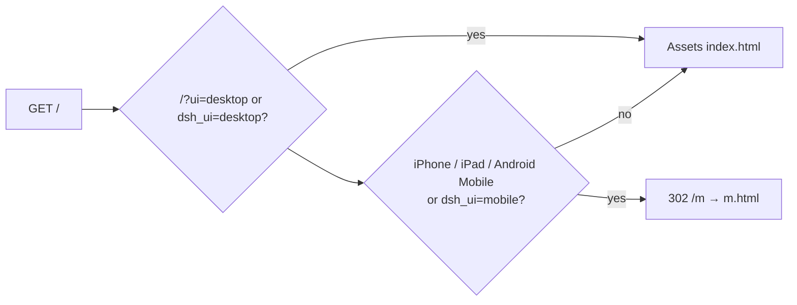

# 09 · Web surfaces

Official `dsh web` needs Node `__ModuleLoader__` and Typert. This host
serves two Workers Assets SPAs over `/api`.

| URL | Who | What |
|---|---|---|
| `/` | desktop | Workbench: rail, sessions, composer |
| `/m` | iPhone, iPad, Android phones | Chat shell |
| `/?ui=desktop` | anyone | Pin workbench (`dsh_ui` cookie) |

`run_worker_first` is true so the Worker can 302 before Assets serves
`index.html`. iPadOS often sends a Macintosh UA; desktop HTML also
checks `navigator.maxTouchPoints > 1` and replaces to `/m`. iPad at
≥768px keeps a persistent session column.

Both SPAs share the auth cookie. History replay uses settled events
only. The SPA never sends `identityKey` and never offers a tenant
picker.

Shared chrome: sessions, fork, compact, stop, slash commands from
`GET /api/commands`, permission preset, ask-user cards.

Next: [Security](10-security.md).
