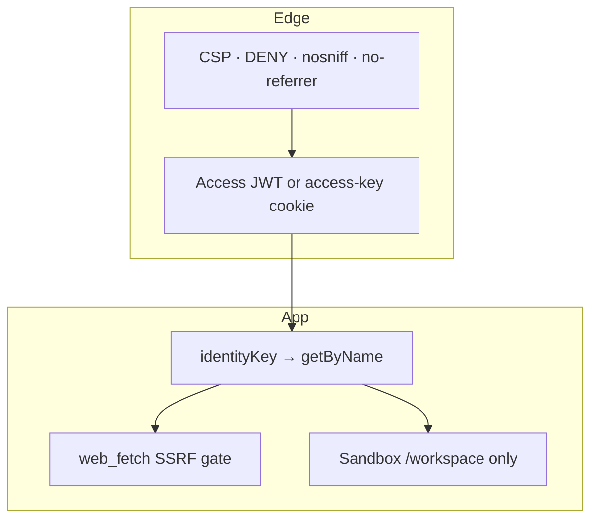

# 10 · Security

Secrets stay in Wrangler secrets / `.dev.vars`. Never in Assets. Never
in logs.

## Auth

- Access JWT verified against team JWKS when configured.
- Unsigned email headers ignored.
- Access-key cookie: HttpOnly, SameSite=Lax, Secure on HTTPS, SHA-256
  constant-time compare.
- `/api/login` trims pasted keys (iOS autofill).
- `preview_urls` is false.

Until Access is on, anyone who can reach the Worker URL **and** the
access key shares `"owner"`. Rotate `DSH_CF_ACCESS_KEY` if it leaks.

## HTTP

Responses set `Content-Security-Policy` (`default-src 'self'`),
`X-Frame-Options: DENY`, `X-Content-Type-Options: nosniff`,
`Referrer-Policy: no-referrer`, `Cross-Origin-Resource-Policy:
same-origin`. `robots.txt` disallows crawlers.

## Tools

`web_fetch` rejects credentials, localhost, and IP literals. HTML is
stripped to text. `web_search` is DeepSeek server-side search, not an
open proxy.

Linux cannot see the host. Plan mode blocks mutating tools.
`workspace-write` asks before bash/writes.

## Logs

One JSON line: `level`, `msg`, `identityKey`, `sessionId`, `route`,
`doClass`, `elapsedMs`, `err`. JWTs, access keys, API keys, overlay
keys are redacted. Tool results truncated.

Next: [Operate](11-operate.md).
