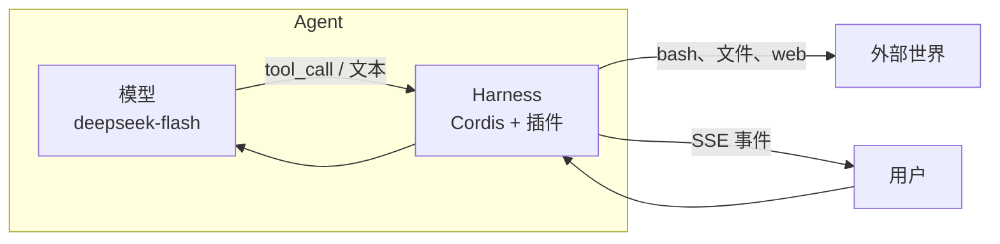

# 01 · 什么是 Harness

**Agent** 是模型加 harness。模型负责字和 tool call。Harness 是其余一切：
历史、工具、权限、跑 bash 的地方、崩溃还能活的日志。

官方 DeepSeek Harness 用同一个公式：

```text
Agent = Model + Harness
Harness = kernel + plugins
```

这里的 **kernel** 是 Cordis 4.x（`@deepseek-ai/cordis`）。一切都是插件。
工具是插件。Agent 循环是插件。设置是插件。这不是比喻，`composeHarness()`
就是这么写的。



## 为什么不是官方 CLI

`npx @deepseek-ai/dsh` 是 Node 进程。它有 YAML Loader、HMR、PTY、
`dsh plugin add`，以及走 Typert RPC 的 Web GUI。这些都不适合 Cloudflare
Worker isolate：

| 官方 DSH 假定 | Worker isolate 有 |
|---|---|
| `node:` API、子进程 | `fetch`、Web Crypto、流、DO SQL |
| 一直活着的进程 | 休眠；内存没了 |
| PTY 和长任务 | 容器里一次性 `exec` |
| 官方前端的 Module Loader | Assets SPA 打 `/api` |

所以这份 port **保留内核、重写宿主**。Linux 进容器。会话日志变成 SQLite。
GUI 是两个静态应用。拆分见[第 02 章](02-system-map.md)。

## 「教学宿主」是什么意思

这份 port 要能读。你可以从 cookie 跟到 `getByName` 再到 `agentLoop.run`。
它不是插件市场，不是 `chat.deepseek.com`，也不能 1:1 装所有官方插件。

**能跑的：** 会话、带 thinking 和工具的 DeepSeek V4.1 Flash、web 搜索/抓取、
`/workspace` 下的 Linux、skills、一次性 subagent、todo、日程、plan、问用户、权限。

**不能跑的：** [core-gaps.md](../../core-gaps.md)。

## 模型

默认 **DeepSeek V4.1 Flash**，id `deepseek-flash`，地址
`https://api.deepseek.com/chat/completions`。用 `DEEPSEEK_MODEL` 覆盖。
密钥留在服务器。浏览器永远看不到。

模型不是架构。换 adapter（`ctx.llm`），循环仍按同一套事件记日志。

下一章：[系统地图](02-system-map.md)。
