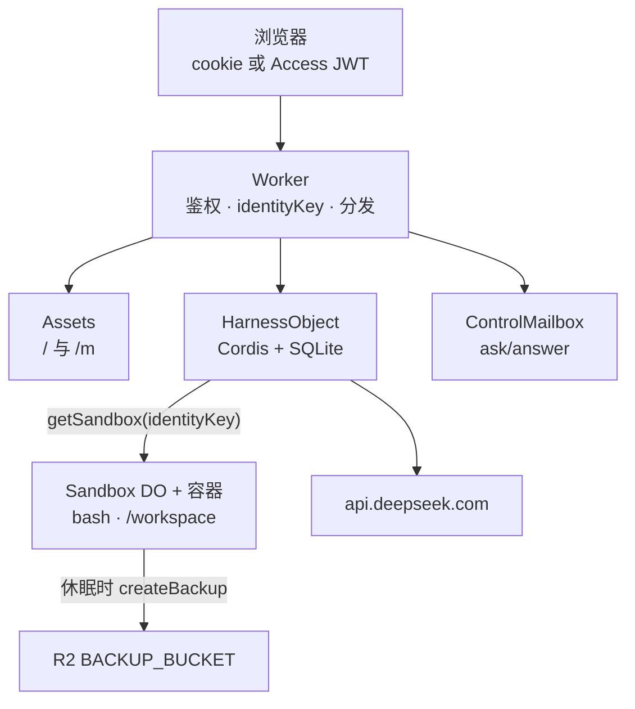
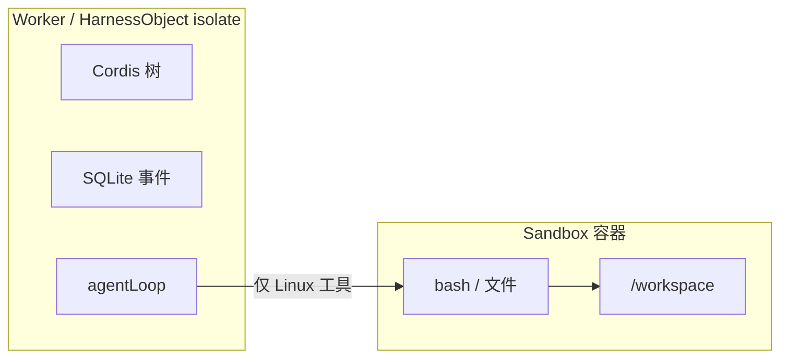

# 02 · 系统地图

五个 Cloudflare 产品、一份 Worker 脚本、三个 Durable Object。Worker 是必须的：
Access、Assets、Durable Objects、Containers、R2 不能互相绑定。

## 谁干什么

| 产品 | 职责 |
|---|---|
| Worker | HTTP 入口、鉴权、`identityKey()`、`getByName` |
| Workers Assets | 桌面 `/`、聊天 `/m`，`run_worker_first` |
| `HarnessObject` | 插件树、会话日志、agent 循环 |
| `ControlMailbox` | `ask_user_question` 的内存等待 |
| `Sandbox` | 官方 `@cloudflare/sandbox` 容器 |
| R2 | 空闲休眠时的 `/workspace` 快照 |
| Access（可选） | 谁可以打这个主机名 |

浏览器从不挑选 Durable Object id。鉴权之后，Worker 对 Harness、Mailbox、
Sandbox **一起** `getByName(identityKey())`。在打开
`IDENTITY_MODE=per-user` 之前，这就是全部租户模型。

## Isolate 与容器

循环、日志、模型 HTTP 都留在 isolate。Bash 和项目目录留在容器。休眠会丢掉
内存里的 Cordis 树。下一次请求再 `composeHarness()`，从只追加的 `events`
表重建模型历史。这与上游 DeepSeek Harness 一致：**模型能看见的事实都是已记录的事件**。

`nodejs_compat` 打开，是因为官方 Sandbox wrangler 模板需要。插件仍不得
`import 'node:'`。

## 请求落到哪

| 路径 | 落到 |
|---|---|
| `GET /`、`/m`、静态资源 | Assets；Worker 可能 302 `/` → `/m` |
| `POST /api/login` | Worker（配了 Access 则禁用） |
| `POST /api/sessions/:id/answer` | ControlMailbox |
| 其他 `/api/*` | `HarnessObject.fetch` |

完整路由：[`web.md`](../../web.md)。身份：[第 03 章](03-identity.md)。
