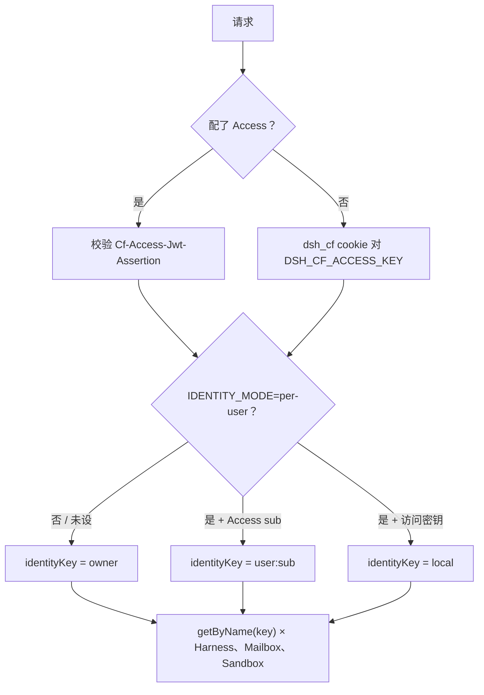

# 03 · 身份

身份是一个字符串。它是 Durable Object 的名字。它不是邮箱。

## 两道门

互斥。

**访问密钥（默认）。** `TEAM_DOMAIN` 与 `POLICY_AUD` 未设。
`POST /api/login` 接受 `DSH_CF_ACCESS_KEY`，种下 `dsh_cf`（HttpOnly、
SameSite=Lax、HTTPS 上 Secure）。这是 `wrangler dev` 和还没配 Access 的
公开 `workers.dev`。

**Cloudflare Access。** 密钥 `TEAM_DOMAIN`、`POLICY_AUD` 已设。Worker 用
团队 JWKS 校验 `Cf-Access-Jwt-Assertion`。从不信任
`Cf-Access-Authenticated-User-Email`。`/api/login` 返回 400。

Access 决定 **谁可以用这个主机名**。租户路由仍是 `identityKey()`。

## 模式

| 模式 | Access JWT | 访问密钥 |
|---|---|---|
| 未设 / `shared-owner` | `"owner"` | `"owner"` |
| `per-user` | `user:` | `"local"` |

默认生产是：**能登录的人共用一个 sandbox、一份 SQLite**。教学宿主故意如此。
只有 Access 已开、且你接受 `max_instances: 5` 限制的是**正在跑的**容器
（不是注册用户数）时，再翻 `IDENTITY_MODE=per-user`。

邮箱只用于展示（`GET /api/me`）。SPA 不回传 `identityKey`，也没有租户选择器。

可选 `LEGACY_OWNER_SUB` / `LEGACY_OWNER_EMAIL` 在翻转时把一个主体留在旧的
`"owner"` 对象上。回滚：去掉 `IDENTITY_MODE` 再部署。闲置的 `user:*` 会休眠，
不会拷回去。

下一章：[一轮 Turn](04-turn.md)。
