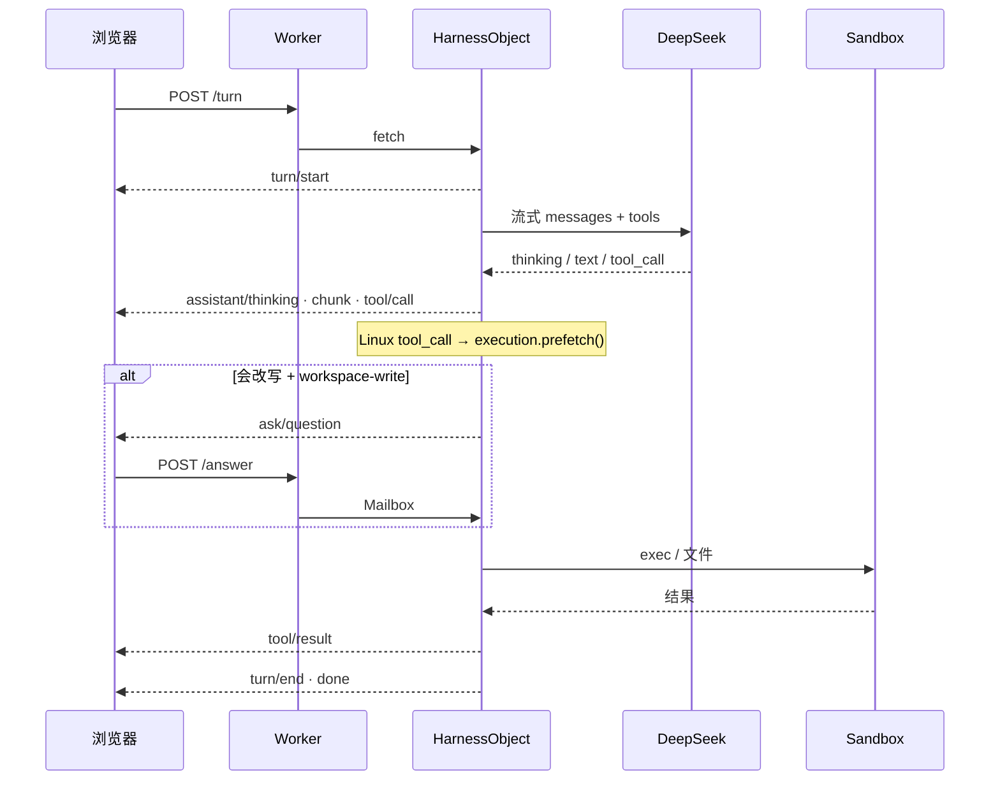

# 04 · 一轮 Turn

一轮 turn 是带消息的 `POST /api/sessions/:id/turn`。Worker 转到
`HarnessObject`。对象用 SSE 推到 `done`。

## 日志才是真相

每个事件都追加进 SQLite：`turn/start`、`user/message`、
`assistant/thinking`、`assistant/chunk`、`assistant/message`、
`tool/call`、`tool/result`、`ask/question`、`ask/answer`、`turn/end`。

模型**看不到**临时拼的数组。它看到的是 `session.deriveMessages()`：把这些
事件投影成 Chat 消息，并跳过 `compaction/summary` 覆盖的区间。休眠之后
isolate 是空的；下一次 compose 从日志重建。这与上游一致：**模型能看见的事实都是已记录的事件**。

SPA 回放历史只用**已完成**的事件（`assistant/message`、工具），不用直播的
`assistant/chunk`，刷新不会把流式文本再贴一遍。

## 循环形状

`AgentLoop` 一轮最多 **24** 步。每一步：

1. 拼 system prompt + `deriveMessages()`
2. 流式打模型
3. 没有 tool call：发出 assistant 消息，结束
4. 否则先过权限，执行每个工具，发出 `tool/result`，下一步

Linux 工具名（`bash`、`read_file`、`write_file`、`list_dir`、`mkdir`、
`delete_file`、`glob`、`grep`、`str_replace_editor`）在 `tool_call` delta
一到就 `execution.prefetch()`，容器唤醒和后面的 token、Allow 提示重叠。

## 权限

| 预设 | 会改写的 Linux 工具 |
|---|---|
| `workspace-write`（默认） | 先问 Allow / Deny（等 5 分钟） |
| `danger-full-access` | 不问 |

读、glob、grep、`str_replace_editor` 的 `view` 不算改写。Plan 模式在退出前
拒绝改写工具。即使 danger-full-access，Linux 也只在 Sandbox `/workspace` 里。

`ask_user_question` 的等待在 `ControlMailbox` 上，因为 UI 还在想的时候
HarnessObject 可能休眠。Turn 的 `AbortSignal` 留在 harness isolate。正在
等用户回答的 turn **不会**跨休眠恢复。

下一章：[插件](05-plugins.md)。
