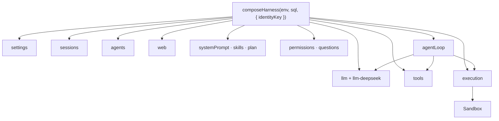

# 05 · 插件

Cordis：一切都是插件。这个宿主不重写内核。`composeHarness()` 把服务挂到
`Context` 上。第三方插件用官方 DSH 同一套形状（`apply`、`inject`、
`ctx.tools.register`）。不得 `import 'node:'`。没有 YAML Loader，没有
`dsh plugin add`。



## 该用的缝

| 服务 | 用来 |
|---|---|
| `ctx.sessions` | 只追加日志、`deriveMessages()`、`fork()`、`remove()` |
| `ctx.agents` | 活的 Agent（`id === session.id`） |
| `ctx.llm` | `stream` / `complete`；`registerAdapter` 换模型 |
| `ctx.web` | 搜索 / 抓取 |
| `ctx.tools` | 给模型看的工具；随 fiber 卸载 |
| `ctx.systemPrompt` | 有序 `section({ name, order, text })` |
| `ctx.commands` | 斜杠命令 |
| `ctx.execution` | Linux。不要自己打容器 |
| `ctx.permissions` | 改写前先问 |
| `ctx.schedule` | 经 `armAlarm` 的闹钟 |

最小插件：

```ts
import type { Context } from "@deepseek-ai/cordis"

export const name = "acme"
export const inject = ["tools", "systemPrompt"]

export function apply(ctx: Context) {
  ctx.tools.register({
    name: "acme_lookup",
    description: "Look up an Acme record",
    parameters: {
      type: "object",
      properties: { id: { type: "string" } },
      required: ["id"],
    },
    async execute(args) {
      return JSON.stringify({ id: args.id })
    },
  })
}
```

从 `composeHarness(..., { plugins: [acme] })` 挂上，或写进 `src/compose.ts`。
注册随 fiber 结束卸载。

完整缝：[`plugins.md`](../../plugins.md)。

下一章：[Linux 沙箱](06-sandbox.md)。
