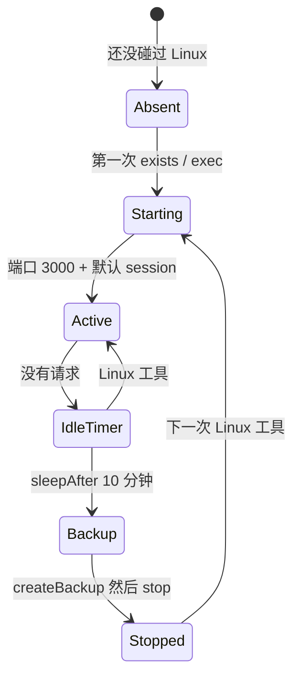

# 06 · Linux 沙箱

Linux 是官方 Cloudflare Sandbox SDK（`@cloudflare/sandbox@0.12.9`），和官方
DSH 用 E2B 是同一类拆分。Harness 循环看不见 shell。`ExecutionService` 调用
`getSandbox(env.Sandbox, identityKey, { sleepAfter: "10m" })`。

## 我们用什么

| 零件 | 取值 |
|---|---|
| 镜像 | `FROM docker.io/cloudflare/sandbox:0.12.9` |
| 规格 | `basic` — 1 GiB、¼ vCPU、4 GB 盘 |
| `max_instances` | 5 个**正在跑的**容器 |
| 休眠 | `sleepAfter = "10m"`，不设 `keepAlive` |
| 客户端 | `exec`、`readFile`、`writeFile`、`listFiles`、`mkdir`、`deleteFile` |

登录、列 session、纯聊天 **不会** 起容器。调研工具（`web_search`、`web_fetch`）
也不会。

## 隔离

容器就是隔离边界。Worker 里没有 Landlock。即使 `danger-full-access` 也看不见
宿主文件系统。路径解析在 `/workspace` 下；逃逸会抛错。

`AbortSignal` 不能走 RPC。`sandbox.exec` 用 120 秒超时，不转发浏览器 abort。

## 容量

超过 `max_instances` 的启动会让 Linux 工具失败，错误字符串稳定：容量到了，
等别的 workspace 睡。睡着的 sandbox 不占槽。共享 `"owner"` 是整个教学宿主
一个槽。

Cloudflare 仍可能因平台原因 SIGTERM 正在跑的实例。不要把活容器当成永久机器。

下一章：[持久化](07-persistence.md)。
