# 08 · 延迟

Cloudflare FAQ 里容器冷启动常见 **1–3 秒**，测的是很小的 Go/Node hello-world。
这个宿主不是那张镜像。生产探测，2026-09-13，`maa05`，
`cloudflare/sandbox:0.12.9` 跑在 `basic` 上，先显式 `stop()`：

```mermaid
gantt
  title 休眠再醒 boot（毫秒）
  dateFormat X
  axisFormat %s
  section Boot
  读 handle              :a, 0, 13
  唤醒容器               :b, 13, 8768
  unsquashfs restore     :c, 8768, 10056
  section Exec
  uname                  :d, 10056, 10114
```

| 步骤 | 毫秒 | 是什么 |
|---:|---:|---|
| Handle | 13 | DO `loadWorkspaceBackup()` |
| **唤醒** | **8768** | 第一次容器 RPC：供给 + 端口 3000 + 默认 session |
| **Restore** | **1288** | `localBucket` 解压 `/workspace` |
| Ensure | 0 | restore 命中则跳过 |
| `uname` | 58 | 箱子起来之后 |
| **Boot 合计** | **~10056** | |

热路径、同一 isolate：boot **0ms**，`uname` **~55ms**。`stop()` 之后的聊天：
DeepSeek 到第一个 `tool_call` **~2.1s**；`tool_call` 到 `tool/result` **~7.7s**。
Prefetch 从 Linux `tool_call` 开始，所以唤醒只和流的后半、以及 Allow 重叠——
挡不住模型还没吐出工具名的那 2 秒。

## 为什么唤醒约 9 秒

官方镜像是 Debian + Node + Bun + sandbox 控制面（inspect 约 225MB，Docker
显示约 850MB virtual）。Cloudflare 会预取镜像；sleep-wake 仍是 8.8 秒，所以
**不是 pull**。是 **¼ vCPU** 上跑入口。镜像设了 `JAVASCRIPT_POOL_MIN_SIZE=3`
和 `TYPESCRIPT_POOL_MIN_SIZE=3`。换成 Alpine 会弄坏 SDK。

## 默认不会做的

| 想法 | 为什么不做 |
|---|---|
| 每条用户消息都 prefetch | 只挡住约 2s LLM；误唤醒占 `basic` 10 分钟 |
| `keepAlive: true` | 永不睡；必须 `destroy()` |
| 自制瘦镜像 | 留着官方 `cloudflare/sandbox` |

打开 session 时 prefetch 能把 8.8 秒藏进打字。这是可选项；一旦 `per-user`
sandbox 共享五个槽，就贵。

## 官方整盘 snapshot

2026-04-13 宣布「未来几周」（`persistAcrossSessions: { type: "disk" }`）。
到 2026-09，Containers FAQ 仍写 coming soon；Codex-on-Containers 教程称为
**private beta**（找 Cloudflare 代表开通）。宣传的 restore：**约 2 秒** 对比
30 秒 clone+install。内存 snapshot（进程接着跑）更往后。这个宿主不等它，
用目录 backup。

## Fly.io

作为**第二**后端可行，不是 drop-in。Machines 宣称 VM 启动约 300ms；小镜像
&lt;2s；已有 stopped Machine 再 start 很快。瘦 guest agent 加 volume，体感可以
**0.5–2s**。停着的 rootfs 和 volume 仍计费（约 $0.15/GB/月）。睡得多的教学宿主
在 Cloudflare 上更便宜。细节：[`sandbox-flyio.md`](../../sandbox-flyio.md)。

下一章：[Web 界面](09-web.md)。
