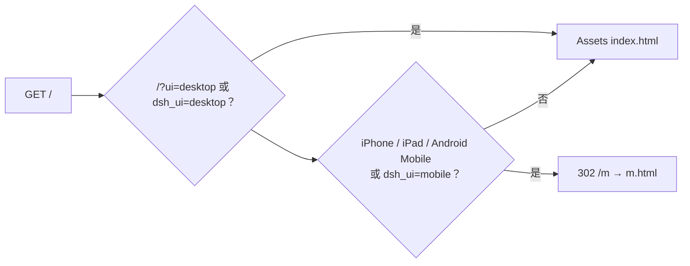

# 09 · Web 界面

官方 `dsh web` 需要 Node `__ModuleLoader__` 和 Typert。这个宿主用 Workers
Assets 上的两个 SPA 打 `/api`。

| URL | 谁 | 是什么 |
|---|---|---|
| `/` | 桌面 | 工作台：轨、会话、composer |
| `/m` | iPhone、iPad、Android 手机 | 聊天壳 |
| `/?ui=desktop` | 任何人 | 钉住工作台（`dsh_ui` cookie） |

`run_worker_first` 为 true，Worker 能在 Assets 吐 `index.html` 之前 302。
iPadOS 经常发 Macintosh UA；桌面 HTML 还会看 `navigator.maxTouchPoints > 1`
再跳到 `/m`。iPad ≥768px 保留常驻会话列。

两个 SPA 共用鉴权 cookie。历史回放只用已完成事件。SPA 从不发送
`identityKey`，也没有租户选择器。

共用的壳：会话、fork、compact、停止、`GET /api/commands` 的斜杠命令、权限预设、
问用户卡片。

下一章：[安全](10-security.md)。
