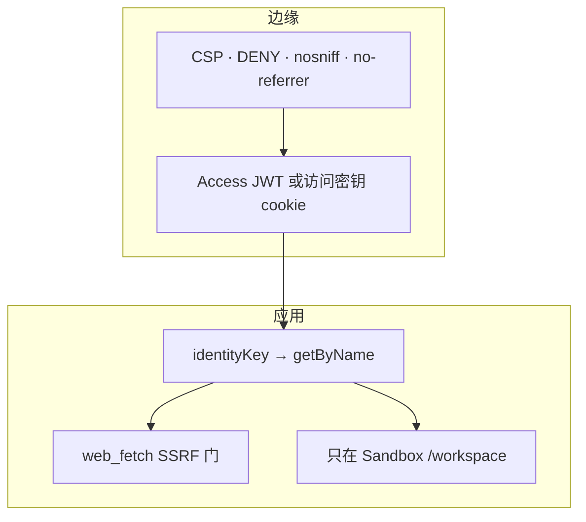

# 10 · 安全

密钥只在 Wrangler secrets / `.dev.vars`。永不进 Assets。永不进日志。

## 鉴权

- 配了 Access 就用团队 JWKS 验 JWT。
- 不签名的邮箱头一律忽略。
- 访问密钥 cookie：HttpOnly、SameSite=Lax、HTTPS 上 Secure，SHA-256 恒定时间比较。
- `/api/login` 会 trim 粘贴的密钥（iOS 自动填充）。
- `preview_urls` 关闭。

Access 没开时，能打到 Worker URL **并且**拿到访问密钥的人，共用 `"owner"`。
密钥泄露就轮换 `DSH_CF_ACCESS_KEY`。

## HTTP

响应带 `Content-Security-Policy`（`default-src 'self'`）、`X-Frame-Options: DENY`、
`X-Content-Type-Options: nosniff`、`Referrer-Policy: no-referrer`、
`Cross-Origin-Resource-Policy: same-origin`。`robots.txt` 禁止爬虫。

## 工具

`web_fetch` 拒绝带凭证、localhost、IP 字面量。HTML 抽成文本。`web_search`
是 DeepSeek 服务端搜索，不是开放代理。

Linux 看不见宿主。Plan 模式挡住改写工具。`workspace-write` 在 bash/写入前询问。

## 日志

一行 JSON：`level`、`msg`、`identityKey`、`sessionId`、`route`、`doClass`、
`elapsedMs`、`err`。JWT、访问密钥、API 密钥、overlay 密钥会打码。工具结果截断。

下一章：[运维](11-operate.md)。
