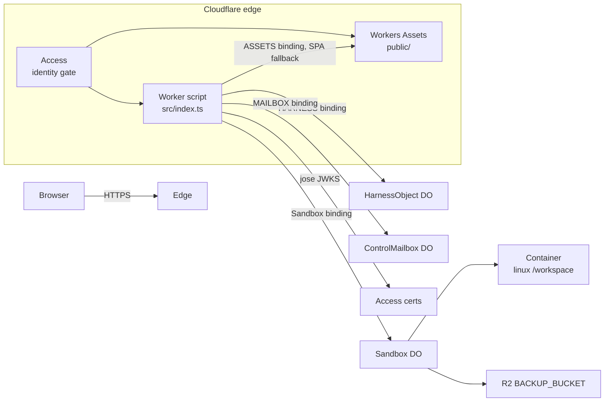

# Cloudflare-native redesign of DeepSeek Harness on Cloudflare

| Field | Value |
|---|---|
| **Title** | Cloudflare-native redesign of `deepseek-harness-cloudflare` |
| **Author** | TBD |
| **Date** | 2026-09-09 |
| **Status** | Draft |
| **Repo** | `git@github.com:dravengarden/deepseek-harness-cloudflare.git` |
| **Code root** | `projects/deepseek-harness-cloudflare/` |
| **Audience** | Senior engineers who already know this host (Cordis kernel, session log, Sandbox Linux, Workers SPA) |

This document answers the product question:

> 所以是不是还得有一套 Cloudflare Worker？请按 Cloudflare 的架构去完整重新 design 吧
>
> *So do we still need a Cloudflare Worker? Please fully redesign according to Cloudflare's architecture.*

**Short answer:** yes, we still need a Worker. Access, static Assets, Durable Objects, Containers, and R2 are not substitutes for a Worker script. A Worker is the only deployable that can *bind* those products and be the HTTP entrypoint. The redesign is not "delete the Worker"; it is to stop using the Worker as a fake Node host, stop stuffing the official `dsh` GUI protocol into it, and line every harness seam up with the published Cloudflare product split.

---

## Overview

`deepseek-harness-cloudflare` is a teaching/demo port of DeepSeek Harness onto Cloudflare. The official `dsh` CLI and Node `dsh web` (Typert RPC + `window.__ModuleLoader__`) are **not** the host. Today's code already runs Cordis inside a Durable Object, Linux in `@cloudflare/sandbox`, backups in R2, and a workbench SPA from `public/`. What it does *not* yet do is follow Cloudflare's identity and concurrency model:

1. One `HarnessObject` and one Sandbox are hard-coded to `idFromName("owner")` / `getSandbox(..., "owner")`, even though Cloudflare Access already authenticates an email/`sub`.
2. The Worker is easy to misread as optional ("Access sits in front", "the GUI is static", "the DO holds state"). It is not optional; it is the bindings host.
3. `QuestionGate` is the right actor split (HarnessObject must not *be* the waiter that another HTTP request has to resolve) but is documented as a same-object deadlock hack, and **cancel during ask-user is broken for a different reason**: `AbortSignal` is not passed into `questions.ask`.
4. Official `dsh-web-frontend` cannot boot without a Node Typert plane. A Typert adapter in the Worker is the wrong Cloudflare shape.

The target topology is the Cloudflare product split, mapped onto harness seams:

```text
Access (identity) → Worker (entry + bindings + auth) → Assets (GUI)
                                          ↓
                              HarnessObject DO (Cordis + SQLite session log)
                                          ↓
                         ControlMailbox DO     Sandbox DO + Container (Linux)
                                          ↓
                                         R2 (workspace squashfs)
```

Identity becomes **one HarnessObject and one Sandbox per Access identity** after an explicit `IDENTITY_MODE=per-user` flip. Until then (unset / `shared-owner`), routing stays `"owner"` — including local `wrangler dev`. `"local"` is only the access-key key **after** that flip. The SPA stays on Workers Assets talking `/api`. The agent loop, SQLite, and Linux stay out of the Worker script.

---

## Background & Motivation

### Current state (as of `main`)

The running architecture is already documented in `README.md`, `docs/architecture.md`, `docs/containers.md`, and `docs/web.md`. The important files:

| File | Role today |
|---|---|
| `wrangler.jsonc` | Worker `main: src/index.ts`; Assets `public/` bound as `ASSETS`; DO classes `HarnessObject`, `Sandbox`, `QuestionGate`; R2 `BACKUP_BUCKET`; Container `Sandbox` `instance_type: basic`, `max_instances: 1` |
| `src/index.ts` | Access JWT or access-key cookie; `/api/*` → `env.HARNESS.idFromName("owner")`; `/api/sessions/:id/answer` → `QuestionGate`; everything else `env.ASSETS.fetch` |
| `src/object.ts` | `HarnessObject`: `composeHarness()` once per isolate lifetime; SQLite session log; SSE turns; settings; commands; `alarm()` for schedule |
| `src/sandbox.ts` | Official `Sandbox` subclass; `sleepAfter = "10m"`; `createBackup` of `/workspace` on `onActivityExpired` |
| `src/gate.ts` | In-memory `ask()` / `answer()` waiters |
| `src/plugins/execution.ts` | `getSandbox(env.Sandbox, "owner", { sleepAfter: "10m" })` |
| `src/plugins/questions.ts` | RPC to `QUESTIONS.idFromName(sessionId)` |
| `src/access.ts` / `src/auth.ts` | JWT verify (`jose` + team JWKS) vs local `DSH_CF_ACCESS_KEY` cookie |
| `public/` | Workers-native workbench SPA, not the Typert React client |

The Worker entry is small and already close to the right shape:

```49:76:projects/deepseek-harness-cloudflare/src/index.ts
    if (url.pathname.startsWith("/api/")) {
      const identity = await resolveIdentity(request, env)
      if (!identity) {
        return Response.json({ error: "unauthorized" }, { status: 401 })
      }
      if (url.pathname === "/api/me") {
        return Response.json({
          ok: true,
          model: env.DEEPSEEK_MODEL || "deepseek-v4-flash",
          email: identity.email,
          auth: identity.source,
        })
      }
      const answerMatch = url.pathname.match(/^\/api\/sessions\/([^/]+)\/answer$/)
      if (request.method === "POST" && answerMatch) {
        // ... routed to QuestionGate, not HarnessObject
      }
      const id = env.HARNESS.idFromName("owner")
      return env.HARNESS.get(id).fetch(request)
    }

    return env.ASSETS.fetch(request)
```

Identity is verified, then thrown away. `/api/me` returns `email`, but routing ignores it. The README is explicit: "Access decides *who may use* the app; it does not create one sandbox per user."

### Pain points this redesign must close

1. **User confusion about the Worker.** If Access sits in front, if `public/` is static, and if `HarnessObject` holds Cordis + SQLite, why is `src/index.ts` still there? The current docs describe *what* the Worker does, not *why Cloudflare requires it*.
2. **Single-owner DO is not the Cloudflare identity model.** Access JWTs already carry `email` and `sub` (`src/access.ts`). Sandbox docs say: *in user-facing apps, scope IDs to a single user*. We do the opposite (`OWNER_SANDBOX_ID = "owner"` in `src/plugins/execution.ts`, `max_instances: 1` in `wrangler.jsonc`).
3. **Official `dsh` GUI cannot boot here.** `docs/web.md` already records that `@deepseek-ai/dsh-web-frontend` needs `window.__ModuleLoader__`, `window.__DSH_BOOT__`, and Typert `/api/remote.mux`. Stuffing that host plane into the Worker would make this a Node protocol shim, not a Cloudflare app.
4. **QuestionGate is framed as a same-object deadlock hack; the real cancel bug is AbortSignal.** Answers correctly go to a second DO (`src/index.ts` `/answer` → `QuestionGate`). `POST /api/sessions/:id/cancel` already reaches `HarnessObject` (`src/object.ts` `cancelMatch` → `agentLoop.cancel`) and *can* be delivered while a turn is in-flight: `fetch` returns an SSE `ReadableStream` immediately (`src/lib/sse.ts`), and input gates open during LLM `fetch` and mailbox RPC. What cancel does **not** do is abort `ctx.questions.ask` (`src/plugins/tool-ask-user.ts`, `src/plugins/permissions.ts` have no `AbortSignal`). Stop during an Allow/Deny or `ask_user_question` waits out `TIMEOUT_MS` (5 minutes).
5. **Product split is implied, not named.** The mapping Access / Worker / DO / Container / R2 / Assets ↔ session / loop / tools / sandbox / GUI should be the architecture, not a side diagram in the README.

### Why now

The port of the harness *core* is done (session log, Flash, web tools, skills, subagents, plan, ask-user, Sandbox Linux). The remaining design debt is *shape*: identity, entrypoint, GUI protocol, and concurrency. That is exactly what a Cloudflare-native redesign is for. It does not require re-porting Cordis.

---

## Goals & Non-Goals

### Goals

1. **Answer "do we still need a Worker?"** in platform terms, and make the Worker script obviously only entry + auth + binding fan-out.
2. **Name the Cloudflare products** and pin each harness seam to one of them.
3. **Switch identity** from `idFromName("owner")` to one `HarnessObject` + one Sandbox + one mailbox per Access identity. The *architecture* target is per-user (`user:${sub}`; local access-key → `"local"`). The *ship default* is unset `IDENTITY_MODE` = `shared-owner` (`"owner"`), including `wrangler dev`, so existing SQLite is not silently orphaned.
4. **Keep the Workers-native SPA** on Assets + `/api`. Do not host `dsh-web-frontend` or run the Node GUI binary.
5. **Keep Container + R2 persistence** as already researched: ephemeral disk, `sleepAfter: "10m"`, `createBackup` on `onActivityExpired`, restore when `/workspace/.dsh-cf` is missing.
6. **Keep a ControlMailbox for ask/answer/abort** (HarnessObject is not the waiter). **Fix cancel by keeping `POST /cancel` on `HarnessObject`**, listening to the turn `AbortSignal` **in the harness isolate**, and calling serializable `mailbox.abort(sessionId, id)`. Do **not** pass `AbortSignal` over Durable Object RPC. Do not invent a generation-counter `waitCancel` RPC.
7. **Produce a file-level migration** from today's `src/index.ts`, `src/object.ts`, `src/sandbox.ts`, `src/gate.ts`, `public/`.
8. **Ship incrementally** via independently mergeable PRs (see [PR Plan](#pr-plan)).

### Non-goals

- Official `dsh` CLI, YAML Loader, HMR, `dsh plugin add`.
- Running `@deepseek-ai/dsh-web-app` or implementing Typert `/api/remote.mux`.
- Replacing Cordis with Cloudflare's `@cloudflare/agents` SDK. The kernel stays `@deepseek-ai/cordis` 4.x (`src/compose.ts`).
- PTY / `terminal_*`, Landlock, LSP, MCP stdio, workflow/ralph, `node:vm` plugins, vision, PowerShell — still out of scope per `docs/core-gaps.md`.
- Continuable/background jobs that survive hibernation. One-shot in-process subagents (max depth 3) stay.
- Per-user DeepSeek API keys. `DEEPSEEK_API_KEY` remains a Worker secret shared by identities on this deploy. (A later settings document could store a user key; not this redesign.)
- Multi-region pin / `locationHint` tuning.
- Cap'n Web as the browser protocol (optional future; not required to be Cloudflare-native).
- Automatically copying the existing `idFromName("owner")` SQLite into a per-user DO. Call it out, provide an opt-in alias, do not build a general DO export tool.

---

## Proposed Design

### 1. Do we still need a Worker?

**Yes. A Worker script is the only thing that can bind Durable Objects, Containers, R2, and Assets, and that can validate Access JWTs on `/api`.** Cloudflare Access is an identity reverse proxy. It is not an application runtime. Static assets are not an application runtime. A Durable Object cannot receive public HTTP without a Worker (or Pages Function, which *is* a Worker) that holds the binding.

Cloudflare's own walkthrough is this sequence: export a `fetch` handler on the Worker → read `env` bindings → `env.MY_DURABLE_OBJECT.getByName(...)` / `idFromName` → call the stub. Bindings are declared on the Worker in `wrangler.jsonc` and delivered as `env`. There is no supported path that looks like "Access → Durable Object" or "R2 public bucket → Container".

Concretely, for this repo:

| Belief | Reality |
|---|---|
| "Access sits in front, so we don't need a Worker" | Access injects `Cf-Access-Jwt-Assertion`. Something must verify it (`src/access.ts` already does; unsigned `Cf-Access-Authenticated-User-Email` is untrusted). Access cannot `idFromName`, cannot `getSandbox`, cannot read R2. |
| "The GUI is static, so we don't need a Worker" | Workers Assets can serve `public/` *without* invoking the Worker (`run_worker_first` defaults to false). That only makes the Worker *not* the static hot path. `/api/*`, login cookie, and all bindings still need the script. Pages Functions would also be a Worker. |
| "The DO holds state, so the Worker is redundant" | A DO class is exported *from the Worker module* (`export { HarnessObject }`, `export { Sandbox }`, `export { QuestionGate }` in `src/index.ts`) and bound in `wrangler.jsonc`. No Worker module ⇒ no DO class in the isolate ⇒ no object. |
| "Put the loop in a Container and skip the Worker" | Containers are reached through a Durable Object class that the Worker binds (`containers[].class_name: "Sandbox"`). The loop belongs in the isolate (SQLite + Cordis), not in Linux. |

The Worker is therefore **required infrastructure**, not a leftover from a Node port. The redesign makes that obvious by shrinking what the Worker is allowed to do (next section) rather than by deleting it.



### 2. What the Worker is for vs not for

**Worker is for:**

- Declaring and receiving bindings (`HARNESS`, `Sandbox`, `MAILBOX`, `ASSETS`, `BACKUP_BUCKET`, secrets, vars).
- Serving as the public HTTP entry (`fetch`).
- Validating Cloudflare Access JWTs (`TEAM_DOMAIN`, `POLICY_AUD`) or the local access-key cookie.
- Deriving a **stable identity key** via `identityKey()`: unset/`shared-owner` → `"owner"`; `per-user` + Access → `user:${sub}` (email is display-only; missing `sub` → 403); `per-user` + access-key → `"local"`.
- Routing `/api/*` to the *correct* Durable Object stubs. The browser never chooses a DO id.
- Serving SPA fallback via `env.ASSETS` when a path is not an asset (login HTML is an asset; `/api` is not).
- Cheap JSON that does not need SQLite: `/api/me`, `/api/login`, `/api/logout`.

**Worker is not for:**

- The agent loop (`src/plugins/agent-loop.ts`).
- Cordis `composeHarness()` (`src/compose.ts`).
- Session SQLite (`sessions` / `events` / `settings` / `schedules` tables).
- Linux (`bash`, files, glob/grep). That is the Sandbox Container.
- Holding `ask_user_question` waiters.
- DeepSeek streaming except as a pass-through of the DO's SSE `Response`.
- Typert mux, `window.__ModuleLoader__` injection, process-token cookies.

Target `src/index.ts` shape (illustrative). `Request` headers are immutable; if we ever attach display headers we must `new Request(request, { headers })`. Identity for the DO is the **object name**, not a header — see §4 and §9.

```ts
export default {
  async fetch(request: Request, env: Env): Promise<Response> {
    const url = new URL(request.url)

    if (url.pathname === "/api/login")  return login(request, env)
    if (url.pathname === "/api/logout") return logout(request, env)

    if (url.pathname.startsWith("/api/")) {
      const identity = await resolveIdentity(request, env)
      if (!identity) return Response.json({ error: "unauthorized" }, { status: 401 })
      if (url.pathname === "/api/me") return me(env, identity)

      let key: string
      try {
        key = identityKey(identity, env) // "owner" | "local" | "user:<sub>"
      } catch (error) {
        if (error instanceof IdentityError) {
          return Response.json({ error: error.message }, { status: 403 })
        }
        throw error
      }
      const mailbox = env.MAILBOX.getByName(key)
      const harness = env.HARNESS.getByName(key)

      // Ask-user answers resolve a waiter on the mailbox, not on HarnessObject.
      const answerMatch = url.pathname.match(/^\/api\/sessions\/([^/]+)\/answer$/)
      if (request.method === "POST" && answerMatch) {
        const body = await request.json().catch(() => ({})) as { id?: string; answer?: string }
        if (!body.id || !body.answer) {
          return Response.json({ error: "id and answer are required" }, { status: 400 })
        }
        const ok = await mailbox.answer(answerMatch[1]!, body.id, body.answer)
        return Response.json({ ok })
      }

      // Cancel stays on HarnessObject (agentLoop.cancel → QuestionService → mailbox.abort).
      return harness.fetch(request)
    }

    return env.ASSETS.fetch(request)
  },
}
```

Leave `run_worker_first` **false** (current default). Static `public/index.html`, `app.js`, `styles.css`, `favicon.svg` stay on the Assets pipeline; Access still authenticates the hostname. Set `run_worker_first: true` later only if we need to inject CSP / HTML headers on every document.

### 3. Target topology — Cloudflare products × harness seams

| Harness seam | Cloudflare product | Unit of isolation | Code today → target |
|---|---|---|---|
| Public HTTP + bindings | **Worker** | One script per deploy | `src/index.ts` stays; loses `"owner"` hard-code |
| GUI | **Workers Assets** | `public/` directory | keep SPA; no Typert |
| Who is this? | **Cloudflare Access** | JWT `sub` / `email` | `src/access.ts` already verifies; Worker now *routes* on it |
| Session log, settings, schedule, Cordis tree, agent loop | **Durable Object + SQLite** (`HarnessObject`) | One DO per identity | `src/object.ts`; `idFromName(identityKey)` |
| Ask-user + permission Allow/Deny waiters | **Durable Object** (`ControlMailbox`) | One mailbox per identity | `src/gate.ts` → `src/mailbox.ts` |
| Cancel in-flight turn | **Same `HarnessObject`** + serializable `mailbox.abort(sessionId, id)` | Per identity (the harness that owns the loop) | keep `POST /cancel` on `src/object.ts`; harness-local `AbortSignal` in `questions.ts` |
| Linux bash + `/workspace` | **Containers** via **Sandbox DO** (`@cloudflare/sandbox`) | One sandbox id per identity | `src/sandbox.ts`, `src/plugins/execution.ts` |
| Workspace across sleep | **R2** `BACKUP_BUCKET` | `backups/{backup.id}/data.sqsh` | unchanged mechanism; naturally per-sandbox because the handle lives in Sandbox DO storage |
| Model | Outbound `fetch` to `api.deepseek.com` | Shared Worker secret | `src/plugins/llm-deepseek.ts`, `web-search-deepseek.ts` |
| Public web fetch | Outbound `fetch` + SSRF gate | Per request | `src/lib/ssrf.ts` |
| Schedule fire | **Durable Object Alarms** | Per HarnessObject | `src/plugins/schedule.ts` `armAlarm` → `setAlarm` |

```mermaid
flowchart TB
  subgraph gui [Workers Assets]
    SPA["public/index.html + app.js<br/>workbench SPA /api client"]
  end

  subgraph worker [Worker - entry only]
    Auth["resolveIdentity()<br/>Access JWT or access-key"]
    Route["identityKey() → getByName"]
  end

  subgraph doid ["Per Access identity"]
    H["HarnessObject<br/>SQLite: sessions, events, settings, schedules<br/>composeHarness() in memory"]
    M["ControlMailbox<br/>in-memory ask waiters"]
    S["Sandbox DO<br/>DirectoryBackup handle"]
  end

  subgraph linux [Container]
    W["/workspace<br/>ephemeral disk"]
  end

  R2["R2 BACKUP_BUCKET<br/>squashfs TTL 7d"]
  LLM["api.deepseek.com<br/>V4 Flash + web_search"]

  SPA -->|GET /| gui
  SPA -->|/api/*| Auth --> Route
  Route --> H
  Route -->|answer only| M
  Route -->|cancel stays on harness| H
  H -->|RPC ask / abort strings only| M
  H -->|getSandbox(ctx.id.name)| S --> W
  S -->|createBackup on idle| R2
  H -->|fetch stream| LLM
```

**Latency / load envelope (teaching deploy, handful of Access users):**

| Path | Expected | Notes |
|---|---|---|
| `GET /` static | < 50 ms edge | Assets, Worker not invoked |
| `GET /api/me` | < 50 ms | Worker only, JWKS cached in isolate |
| `GET /api/sessions` | 20–80 ms | one DO SQLite read |
| `POST /api/sessions/:id/turn` SSE | seconds to minutes | dominated by Flash + tools; DO stays awake for the stream |
| `ask_user_question` wait | up to 5 min (`TIMEOUT_MS` in `tool-ask-user.ts`) | mailbox in-memory waiter; cancel calls `mailbox.abort(sessionId, id)` so the `ask` RPC settles |
| First Linux tool | seconds–tens of seconds | cold Container start; image already pushed |
| Warm `bash` | hundreds of ms | Sandbox RPC; each SDK call is a subrequest unless we later enable Sandbox RPC transport |
| Idle sandbox | sleep after 10 min | billing stops; next start restores from R2 |

**Storage envelope:**

- HarnessObject SQLite: session events are JSON text. A busy teaching user is likely 1–20 MB, not GB.
- R2 backup: `/workspace` squashfs. Order-of tens of MB per identity if the user is not dumping datasets into the sandbox. TTL 7 days (`BACKUP_TTL_SECONDS = 604_800` in `src/sandbox.ts`).
- Container `basic`: 1 GiB RAM / 4 GB disk / ¼ vCPU, billed while the instance is running. Included Workers Paid allotment is 25 GiB-hours memory / month. Order-of-magnitude: one `basic` instance that sleeps after 10 minutes, 20 times a month ≈ 3.3 GiB-hours — inside the included bucket **if sessions do not overlap**. Concurrent users and long turns add linearly; treat 3.3 as a floor, not a budget. The cost *and capacity* risk is concurrent **running** containers (`max_instances`), not SQLite.

**Sandbox official guidance we will follow:** `getSandbox(env.Sandbox, userId)` — "In user-facing apps, scope IDs to a single user." Same string as the HarnessObject name.

### 4. Identity

#### Current

```text
Access JWT  ──►  Worker allows or 401
                     │
                     ▼
              idFromName("owner")     // HarnessObject
              getSandbox(..., "owner") // Sandbox
              idFromName(sessionId)    // QuestionGate
```

`resolveIdentity` returns `{ email, source: "access" | "key" }` and drops `sub` (`src/auth.ts`). `verifyAccessJwt` already parsed `sub` (`src/access.ts`).

#### Target (Cloudflare-native)

```text
Access JWT  ──►  Worker verifies  ──►  identityKey
                                         │
                    ┌────────────────────┼────────────────────┐
                    ▼                    ▼                    ▼
            HARNESS.getByName(k)  MAILBOX.getByName(k)  getSandbox(..., k)
```

| `IDENTITY_MODE` | Auth | `identityKey` |
|---|---|---|
| unset or `shared-owner` (ship default) | Access or access-key | `"owner"` |
| `per-user` | Access JWT with `sub` | `user:${sub}` |
| `per-user` | Access JWT missing `sub` | `IdentityError` → Worker **403** (email is display-only, never a tenant id) |
| `per-user` | access-key cookie (`wrangler dev`) | `"local"` (breaking vs today's `"owner"` SQLite) |
| `per-user` + `LEGACY_OWNER_SUB` / `LEGACY_OWNER_EMAIL` | that one Access principal | `"owner"` (case-insensitive email match) |

**Architecture target:** one object graph per Access identity. **Ship default:** `IDENTITY_MODE` unset or `shared-owner` → `"owner"`, so the first merge of routing does not silently abandon existing SQLite. Flipping to `per-user` is an explicit operator step (runbook below). Shared-owner is compatibility, not the end state.

**Do not** let the browser pass a DO name, session-owner, or sandbox id. The Worker derives the key after JWT verification and calls `getByName(key)`. The Durable Object reads **`this.ctx.id.name`** (`DurableObjectId.name` on the pinned `workers-types`) — that string *is* the identity key. No `X-DSH-Identity-Key` header, no sticky `storage.put("identityKey")`. `alarm()` has no HTTP request; it still has `ctx.id.name` (`"owner"` on the legacy object, `user:<sub>` after the flip).

```ts
// src/identity.ts
export type Identity = {
  email: string
  sub?: string
  source: "access" | "key"
}

export function identityKey(identity: Identity, env: Env): string {
  // Safe default: keep existing owner SQLite until the operator opts in.
  if (!env.IDENTITY_MODE || env.IDENTITY_MODE === "shared-owner") return "owner"
  if (identity.source === "key") return "local"
  if (env.LEGACY_OWNER_SUB && identity.sub === env.LEGACY_OWNER_SUB) return "owner"
  if (env.LEGACY_OWNER_EMAIL && identity.email.toLowerCase() === env.LEGACY_OWNER_EMAIL.toLowerCase()) {
    return "owner"
  }
  // Production per-user: sub is the stable Access subject. Email is display-only.
  if (identity.source === "access" && !identity.sub) {
    throw new IdentityError("Access JWT missing sub")
  }
  return `user:${identity.sub}`
}

export class IdentityError extends Error {
  constructor(message: string) {
    super(message)
    this.name = "IdentityError"
  }
}
```

The Worker catches `IdentityError` and returns `{ error }` with **403** (authenticated Access user we refuse to tenant-map), not 500. Missing cookie/JWT remains 401 from `resolveIdentity`.

`getByName` (Workers Binding API) is the current-style equivalent of `idFromName` + `get`. Use it in new code.

Inside `HarnessObject` / `ControlMailbox` / `ExecutionService`:

```ts
const identityKey = this.ctx.id.name ?? "owner"
```

`composeHarness(env, sql, { identityKey, armAlarm })` gets that name. `ExecutionService` calls `getSandbox(env.Sandbox, identityKey, { sleepAfter: "10m" })`. Schedule `alarm()` after deploy on the existing `owner` object — even before any new `fetch` — therefore uses sandbox id `"owner"`, which is what `LEGACY_OWNER_*` / `shared-owner` want.

#### Migration of existing `owner` SQLite

Durable Object SQLite is **per object id**. Changing the name creates a new empty database. There is no platform "rename DO".

**First production deploy of the identity PR keeps `IDENTITY_MODE` unset (`shared-owner`).** Routing stays `getByName("owner")`. No data moves, no data is orphaned.

**Flip to per-user (blocking runbook):**

1. Confirm whether `idFromName("owner")` has sessions you still need (`GET /api/sessions` on the current deploy).
2. If yes, set `LEGACY_OWNER_SUB` (preferred) or `LEGACY_OWNER_EMAIL` to that Access principal **in the same deploy** as `IDENTITY_MODE=per-user`. That one user keeps the old object; everyone else gets `user:<sub>`.
3. If the `owner` SQLite is disposable, set `IDENTITY_MODE=per-user` without an alias and accept a one-time empty session list. Document it in the deploy notes.
4. Do not build a copy job in v1.
5. **Local wrangler:** `per-user` + access-key routes to `"local"`, not `"owner"`. That is a **breaking local change** — `wrangler dev` SQLite under `"owner"` will not show up. Stay on unset/`shared-owner` to keep it, or treat local state as disposable. README must say this.

Worker logs once per request that first hits a `user:` key (not the JWT): `identity.route key=user:… mode=per-user`. There is no cheap way for that isolate to know whether `owner` still has rows; the runbook is the guard, not a boot-time probe of another DO.

`QuestionGate` today is keyed by **session id**. After PR 2 the mailbox is one object named `"owner"` with waiters keyed `(sessionId, questionId)`. After the identity flip, the Worker addresses `MAILBOX.getByName(identityKey)` — same waiter schema, no row migration (v1 waiters are in-memory anyway).

Session ids remain random (`randomId("ses")`) and are only meaningful inside one HarnessObject, so they are not a cross-tenant capability.

#### `max_instances`

`wrangler.jsonc` has `"max_instances": 1` because there is one owner. Per-user sandboxes require this to rise. Official Sandbox getting-started: "If you expect to have multiple sandbox instances, you can increase `max_instances`."

Recommendation: **`max_instances: 5`** for the teaching deploy, raised **in the same PR** that splits sandbox ids (see PR Plan). This is a cap on **concurrent running containers**, not on registered Access users. Sleeping sandboxes do not consume `max_instances` (sandbox id ≠ live container; `docs/containers.md`). Fifty idle users with slept containers are fine; six users executing `bash` at once are not.

A 6th concurrent Linux start fails provision. `ExecutionService.ready()` must catch that and return a stable tool/SSE error string, not a raw exception:

```text
sandbox capacity reached (max_instances); retry when another workspace sleeps
```

Log `identityKey` + `max_instances` on that path. Do not retry-loop inside the tool. The number **5 is the planned teaching-deploy cap** (resolved; do not change `wrangler.jsonc` until the identity-routing PR).

### 5. GUI

#### Recommend: keep the Workers-native SPA

`public/` is already the right Cloudflare GUI:

- Assets directory, official dark tokens, rail + session sidebar, SSE turns, slash commands, ask-user cards (`public/index.html`, `public/app.js`).
- Talks `/api/sessions`, `/turn` (SSE), `/answer`, `/settings`, `/commands` — the same harness HTTP the DO already implements.
- Production auth is Access (no login form). Local auth is the access-key card. `/api/me` fills `#user-email`.

Changes in this redesign are small: `GET /api/me` always includes `identityKey` (the DO name) and `sub` when present; **cancel URL is unchanged** and still hits `HarnessObject`; do not add a client-side tenant picker.

#### Reject: host official `dsh-web-frontend`

`docs/web.md` is already correct. The official client boots only after a **Node** host injects `window.__ModuleLoader__` and `window.__DSH_BOOT__`, then speaks Typert RPC (`/api/remote.mux`, `session.create` / `session.prompt`, process-token cookie, loopback Host fence). None of that exists on Workers. The Node binary `@deepseek-ai/dsh-web-app` is not a Container we want: putting `dsh web` in the Sandbox would make Linux the GUI host and invert the architecture (loop belongs in the isolate).

#### Reject: thin Worker Typert adapter

A "just enough Typert in `src/index.ts`" adapter looks tempting and is the wrong shape:

| Issue | Why it kills the adapter |
|---|---|
| Protocol | Typert mux is the Node GUI host protocol, not a Cloudflare protocol. Cap'n Web is Cloudflare's RPC and still would not speak Typert. |
| Boot graph | Frontend expects `__ModuleLoader__` to load slot plugins from the Node process. We have no Loader (`AGENTS.md`: do not mount `cordis-plugin-loader`). |
| Session API | Official RPC is `session.create` / `prompt` / host-fence. Ours is REST + SSE over Cordis session events. Mapping every Typert method is a second harness. |
| Auth | Process-token cookie vs Access JWT. |
| Churn | Every `dsh-web-frontend` release can break the shim. This repo's value is the CF product split, not tracking DeepSeek's Node GUI. |
| Teaching | A Typert Worker teaches "how to fake Node on Cloudflare", which is the anti-goal. |

If we ever want a richer RPC from the SPA, the native option is **Cap'n Web** or **typed Durable Object RPC** exposed through the Worker — still not Typert. That is a later PR, not part of this redesign. SSE is the natural mapping of `agentLoop.run(..., onEvent)`.

### 6. Container + R2 persistence (keep, identity-scope)

Already researched in `docs/containers.md`. This redesign does **not** change the persistence mechanism. It changes the **sandbox id**.

Keep:

- Image `FROM docker.io/cloudflare/sandbox:0.12.9` matching npm `@cloudflare/sandbox@0.12.9` (`Dockerfile`).
- `instance_type: "basic"` (1 GiB), not `lite`.
- `sleepAfter = "10m"` on the class (`src/sandbox.ts`) and on `getSandbox(..., { sleepAfter: "10m" })`.
- `keepAlive` off.
- `onActivityExpired` → `persistWorkspace()` → `createBackup({ dir: "/workspace", ttl: 7d })` → store handle in Sandbox DO storage (`HANDLE_KEY = "workspace_backup"`) → delete previous `backups/{id}/data.sqsh` + `meta.json` → `super.onActivityExpired()`.
- Restore in `ExecutionService.ready()` only when the handle exists **and** `/workspace/.dsh-cf` is missing (documented FUSE overlay vanishes on sleep).
- `/checkpoint` remains a manual `persistWorkspace()`.
- `LOCAL_DEV=1` → `localBucket: true` so `wrangler dev` uses the R2 binding.

Change:

```ts
// src/plugins/execution.ts — today
const OWNER_SANDBOX_ID = "owner"
return getSandbox(this.config.env.Sandbox, OWNER_SANDBOX_ID, { sleepAfter: "10m" })

// target
return getSandbox(this.config.env.Sandbox, this.config.identityKey, { sleepAfter: "10m" })
```

The backup handle is already per Sandbox Durable Object. Per-user ids therefore give per-user backups with no R2 key schema change (`backups/${backup.id}/...` is globally unique).

```mermaid
sequenceDiagram
  participant Loop as HarnessObject
  participant SB as Sandbox DO
  participant C as Container
  participant R2 as R2
  Loop->>SB: getSandbox(identityKey)
  SB->>C: start if sleeping
  alt marker /workspace/.dsh-cf missing and handle present
    SB->>R2: restoreBackup(handle)
    R2-->>C: FUSE overlay /workspace
  end
  Loop->>C: exec / readFile / writeFile
  Note over C: idle 10m
  C->>SB: onActivityExpired
  SB->>C: createBackup(/workspace)
  C->>R2: data.sqsh + meta.json
  SB->>SB: storage.put(HANDLE_KEY)
  SB->>C: stop()
```

Risk: two identities must never share a sandbox id. Enforced by using the same `identityKey` function for Harness and Sandbox, only in server code.

### 7. Ask-user / approval / cancel

#### Input gates (actual Cloudflare rule)

Durable Objects are single-threaded. Cloudflare **input gates** stay closed while synchronous JS is running **and while a storage operation is in flight**. They **open** when the isolate is not running JS and is not waiting on storage — including `await fetch()`, **Durable Object RPC**, and a plain JavaScript Promise. `ctx.storage.sql.exec` is **synchronous** and does not open the gate. `await ctx.storage.get/put` is the case that **keeps** the gate closed so other events cannot interleave ([input gates](https://blog.cloudflare.com/durable-objects-easy-fast-correct-choose-three/), [Rules of Durable Objects](https://developers.cloudflare.com/durable-objects/best-practices/rules-of-durable-objects/)).

This host's turn path does **not** hold `fetch()` as a single un-returned handler. `HarnessObject.fetch` returns an SSE `ReadableStream`; `agentLoop.run` runs inside `sseStream`'s `start()` (`src/lib/sse.ts`, `src/object.ts` turn handler). During LLM `fetch` and mailbox RPC, other events **can** be delivered to the same `HarnessObject`.

So this snippet is **not** a proven deadlock on this codebase:

```ts
// Not automatically doomed: custom Promises open the input gate.
async fetch(req) {
  if (turn) await this.userAnswer
  if (answer) this.userAnswer.resolve(...)
}
```

`QuestionGate` is still the right **actor** split: HarnessObject runs the loop; a second object holds the waiter that `POST /answer` must resolve. That keeps waiter state out of Cordis, matches today's working `/answer` path, and stays correct if a future change wraps the turn in `blockConcurrencyWhile`. It is **not** "the official fix for a same-object HTTP deadlock on cancel."

#### What is actually broken today

Verified cancel path:

- SPA already POSTs `/api/sessions/${id}/cancel` (`public/app.js`).
- Worker forwards it to `HarnessObject` (`src/index.ts`).
- `agentLoop.cancel` aborts an in-memory `AbortController` (`src/plugins/agent-loop.ts`).
- `llm.stream` and `execution.bash` receive that signal.
- **`ctx.questions.ask` does not.** `tool-ask-user.ts` and `permissions.approve` await `questions.ask(...)` with no `AbortSignal`. Aborting the controller during an ask-user or Allow/Deny wait does nothing until the 5-minute timeout.

The cancel bug is "AbortSignal is not wired through the ask wait," not "same-object HTTP cannot be delivered."

#### Alternative considered: mailbox `waitCancel` generation counter

A `waitCancel(sessionId, token)` RPC raced against the turn, with cancel routed off `HarnessObject`, was sketched in an earlier draft. **Rejected for v1.** It is more moving parts than wiring `AbortSignal`, and a naive implementation has four concrete bugs:

1. **Isolate pin.** `finally { cancelLoop.catch(() => {}) }` does not finish the RPC. A successful 8-second turn would leave HarnessObject and mailbox in an in-flight `waitCancel` until `timeoutMs` (or forever if optional).
2. **Latched cancel.** A stored generation token that is not snapshotted at turn start aborts the *next* turn.
3. **Multiplex.** One mailbox per identity must accept `ask` + Worker `answer` while a wait is outstanding. That only works if waits are in-memory Promises (gate open), not storage-await polls (gate closed).
4. **`waitCancel` does not abort `permissions.approve`** unless that wait is *also* raced or given the same `AbortSignal`.

Keep `POST /cancel` on `HarnessObject`. Listen to `AbortSignal` **in the harness isolate** (`QuestionService.ask`). Settle the mailbox with serializable `abort(sessionId, id)`. **Do not** pass `AbortSignal` into `ControlMailbox.ask` — it is not RPC-serializable.

#### Target: `ControlMailbox` protocol (complete)

One mailbox Durable Object per identity (PR 2: still named `"owner"`; identity PR: `getByName(identityKey)`). **v1 waiters are in-memory**, same as today's `QuestionGate`. SQLite rows do not make an in-flight `ask()` RPC survive isolate eviction; if the mailbox is evicted, the Harness RPC fails and the turn errors — same as today. Durability of a 5-minute wait is the optional resumable-turn follow-up, not this protocol.

**Do not** implement waiters as `while (!answer) await this.ctx.storage.get(...)`. That closes the input gate and prevents `answer()` from running on the same object.

Workers RPC only accepts structured-cloneable values plus a short special list (`Rpc.BaseType` in the pinned `@cloudflare/workers-types`: `void | boolean | number | string | bigint | undefined | null | ArrayBuffer | … | Request | Response | Headers`, plus functions / `RpcTarget` / streams / stubs). **`AbortSignal` is an `EventTarget`. It is not RPC-serializable.** Passing it to `stub.ask(..., signal)` is a `DataCloneError` (TypeScript `never` on the stub), not a live abort subscription on the mailbox isolate. Local `Promise.race` on the harness without settling the mailbox waiter is also wrong: the in-flight `ask()` RPC would still pin both isolates until `timeoutMs`.

```ts
type Waiter = {
  resolve: (text: string) => void
  reject: (error: Error) => void
  timer: ReturnType<typeof setTimeout>
}

export class ControlMailbox extends DurableObject<Env> {
  /** Keyed by `${sessionId}\0${id}` so two sessions (and ask vs a second ask) do not collide. */
  private readonly pending = new Map<string, Waiter>()

  async ask(sessionId: string, id: string, timeoutMs: number): Promise<string> {
    const key = `${sessionId}\0${id}`
    if (this.pending.has(key)) throw new Error("duplicate ask id")
    return await new Promise<string>((resolve, reject) => {
      const finish = (fn: () => void) => {
        const waiter = this.pending.get(key)
        if (!waiter) return
        this.pending.delete(key)
        clearTimeout(waiter.timer)
        fn()
      }
      const timer = setTimeout(
        () => finish(() => reject(new Error("ask_user_question timed out"))),
        timeoutMs,
      )
      this.pending.set(key, {
        resolve: (text) => finish(() => resolve(text)),
        reject: (error) => finish(() => reject(error)),
        timer,
      })
    })
  }

  async answer(sessionId: string, id: string, text: string): Promise<boolean> {
    const waiter = this.pending.get(`${sessionId}\0${id}`)
    if (!waiter) return false
    waiter.resolve(text)
    return true
  }

  /** Reject the waiter if present. Serializable; this is how cancel settles `ask()`. */
  async abort(sessionId: string, id: string): Promise<boolean> {
    const waiter = this.pending.get(`${sessionId}\0${id}`)
    if (!waiter) return false
    waiter.reject(new Error("ask_user_question cancelled"))
    return true
  }
}
```

Rules:

| Topic | Rule |
|---|---|
| Wait implementation | In-memory `Promise` + `setTimeout`. **Not** storage poll. `setTimeout` is platform I/O; `answer()` / `abort()` can enter. |
| RPC types | `sessionId`, `id`, `timeoutMs`, `text` are strings/numbers only. **No `AbortSignal` on the stub.** |
| Concurrent waiters | Map keyed by `(sessionId, id)`. Session A `ask` does not starve session B. Two asks on the same session use different ids (`randomId("ask")`). |
| `timeoutMs` | **Required.** Callers pass `5 * 60_000` (`tool-ask-user.ts`, `permissions.ts`). |
| `answer` with no waiter | Return `false`; HTTP `{ ok: false }`. SPA already treats that as a failed send. |
| `abort` with no waiter | Return `false`. `QuestionService` still calls it from `finally` so a dropped harness wait cannot pin the mailbox until `timeoutMs`. |
| Cancel with no in-flight turn | `agentLoop.cancel` is a no-op; HTTP `{ ok: true }` (today's behavior; SPA does not care). |
| Turn-end cleanup | `AbortController` abort in `AgentLoop.run`'s `finally` (already deletes `inflight`). `QuestionService.ask` listens to that signal **locally** and RPC-calls `abort(sessionId, id)`, and calls `abort` again in `finally`. Subagents (`src/plugins/subagents.ts`) already pass `input.signal` into `agentLoop.run` — that same harness-local signal reaches `QuestionService.ask`. Schedule-fired turns (`src/plugins/schedule-runner.ts`) have no SPA cancel; they still pass a controller so `finally` can `abort` the mailbox. |
| `blockConcurrencyWhile` | **Not** around `ask` or the turn. **Yes** around first `composeHarness` (SQL + plugin mount only; see §10). |

**Ask path:**

```mermaid
sequenceDiagram
  participant SPA as public/app.js
  participant W as Worker
  participant H as HarnessObject
  participant M as ControlMailbox
  SPA->>W: POST /api/sessions/ses_…/turn
  W->>H: fetch (object name = identityKey)
  H-->>SPA: SSE ReadableStream (fetch returned)
  H->>H: agentLoop.run in stream start()
  H->>M: RPC ask(sessionId, id, 300000)
  Note over H,M: in-memory Promise; input gate open; no AbortSignal on the wire
  H-->>SPA: SSE ask/question
  SPA->>W: POST /api/sessions/ses_…/answer {id, answer}
  W->>M: RPC answer(sessionId, id, text)
  M-->>H: ask() resolves
  H->>H: append ask/answer, continue tools
  H-->>SPA: SSE tool/result … turn/end
```

**Cancel path (harness-local signal + mailbox.abort RPC):**

```mermaid
sequenceDiagram
  participant SPA as public/app.js
  participant W as Worker
  participant H as HarnessObject
  participant M as ControlMailbox
  Note over H: SSE start() awaiting mailbox.ask(sessionId, id, timeout)
  SPA->>W: POST /api/sessions/ses_…/cancel  body {}
  W->>H: fetch (same HarnessObject)
  Note over H: input gate open (ask RPC in flight)
  H->>H: agentLoop.cancel → local.abort()
  H-->>SPA: { ok: true }
  H->>M: RPC abort(sessionId, id)
  Note over M: in-memory reject; ask() RPC settles
  M-->>H: abort true; ask rejects cancelled
  H-->>SPA: SSE error or turn/end
```

Call-site changes (required). `AbortSignal` stays in the harness isolate; the mailbox only sees strings:

```ts
// src/plugins/questions.ts — harness isolate, not the DO RPC surface
async ask(sessionId: string, id: string, timeoutMs: number, signal?: AbortSignal): Promise<string> {
  const stub = this.config.env.MAILBOX.getByName(this.config.identityKey)
  if (signal?.aborted) {
    await stub.abort(sessionId, id)
    throw new Error("ask_user_question cancelled")
  }
  const onAbort = () => { void stub.abort(sessionId, id) }
  signal?.addEventListener("abort", onAbort)
  try {
    return await stub.ask(sessionId, id, timeoutMs)
  } finally {
    signal?.removeEventListener("abort", onAbort)
    // Settles a waiter if the harness dropped the wait without cancel (pin safety).
    await stub.abort(sessionId, id)
  }
}

// src/plugins/tool-ask-user.ts  (and permissions.approve)
const answer = await ctx.questions.ask(sessionId, id, TIMEOUT_MS, ctx.tools.signal ?? undefined)
```

`ToolService` (or `AgentLoop`) must expose the turn's `AbortController.signal` so tools and `permissions.approve` can pass it **to `QuestionService`**, not to the mailbox stub. Today `ctx.tools.sessionId` is the only turn-scoped field; add `ctx.tools.signal` set for the duration of `run()` (including nested subagent runs, which already swap `sessionId`).

Functions-as-RPC-params would also let the mailbox subscribe to abort, but a string `abort(sessionId, id)` matches `answer()` and stays in `Rpc.BaseType`. Prefer that.

**Hibernation:** a 5-minute `ask()` keeps both HarnessObject (SSE stream + RPC) and ControlMailbox (RPC + timer) in memory. Acceptable for v1. SQLite on the mailbox would not change that. Follow-up: persist the pending tool call in `events`, close SSE, resume on `answer` (optional PR).

**Permissions** (`src/plugins/permissions.ts`) keep calling `ctx.questions.ask`; they pick up the harness-local signal. No separate approval channel.

### 8. File-level migration

| File | Action |
|---|---|
| `wrangler.jsonc` | Add binding `MAILBOX` / class `ControlMailbox`. Migration **exactly** `{ "tag": "v4", "new_sqlite_classes": ["ControlMailbox"] }`. **Do not** use `renamed_classes`. **Keep the `QUESTIONS` binding and `QuestionGate` `class_name` in `durable_objects.bindings` through PR 2–4** (no-op export). PR 5 / tag `v5` removes binding, export, and `{ "deleted_classes": ["QuestionGate"] }` together. Raise `max_instances` 1 → 5 **in the identity PR**. Vars: `IDENTITY_MODE` (unset = `shared-owner`), optional `LEGACY_OWNER_EMAIL` / `LEGACY_OWNER_SUB`. Keep Assets + `nodejs_compat`. |
| `src/index.ts` | `/answer` → `mailbox.answer(sessionId, id, answer)`; `/cancel` still `harness.fetch`; `/api/me` includes `identityKey` + `sub`; identity PR: `getByName(identityKey)` for `HARNESS` and `MAILBOX`. Export `HarnessObject`, `Sandbox`, `ControlMailbox`, stub `QuestionGate`. |
| `src/identity.ts` | **New.** `identityKey()`, `IdentityError`. No header helpers. |
| `src/auth.ts` | Plumb `sub` through `SessionIdentity`. |
| `src/access.ts` | Unchanged verify path. |
| `src/types.ts` | `Env.MAILBOX` and `Env.QUESTIONS` (required until v5). Identity vars. |
| `src/object.ts` | `identityKey = this.ctx.id.name ?? "owner"`; `blockConcurrencyWhile` on first compose (SQL + `composeHarness` only); **keep** `/cancel`. |
| `src/mailbox.ts` | **New.** In-memory `ask` / `answer` / `abort` as specified in §7. No `AbortSignal` parameters. |
| `src/gate.ts` | Keep a no-op `export class QuestionGate extends DurableObject {}` until v5 `deleted_classes`. Do not delete in the mailbox PR. |
| `src/sandbox.ts` | No logic change. |
| `src/compose.ts` | `ComposeOptions.identityKey` from `ctx.id.name`; pass to `ExecutionService` and `QuestionService`. |
| `src/plugins/execution.ts` | Drop `OWNER_SANDBOX_ID`; `getSandbox(..., identityKey)`; map provision errors to the stable string in §4. **Same PR as identity routing.** |
| `src/plugins/questions.ts` | `stub.ask(sessionId, id, timeoutMs)` plus harness-local `signal` → `stub.abort(sessionId, id)`. |
| `src/plugins/agent-loop.ts` | Set `ctx.tools.signal` for the turn; abort controller still in `finally`. No `waitCancel`. Does not pass the signal across RPC. |
| `src/plugins/tools.ts` | Add `signal?: AbortSignal` next to `sessionId`. |
| `src/plugins/tool-ask-user.ts` | Pass `ctx.tools.signal` into `questions.ask`. |
| `src/plugins/permissions.ts` | Same. |
| `src/context.ts` | No `ctx.mailbox` required; `ctx.questions` is enough. |
| `public/app.js` | Cancel path unchanged. Optionally show `identityKey` from `/api/me`. |
| `test/identity.test.ts` | `identityKey()` cases: missing `sub` fail-closed, `LEGACY_OWNER_EMAIL` case fold, local, shared-owner. |
| `test/mailbox.test.ts` | Waiter map: answer completes; `abort()` RPC rejects before timeout; `abort` with no waiter returns `false`; timeout rejects; duplicate id throws; next ask after abort is not auto-cancelled. |
| `docs/*`, `README.md`, `AGENTS.md` | Product split; Worker-is-required; no Typert; `IDENTITY_MODE`; `owner` → `local` breaking local change; `max_instances` = running containers. |

`src/plugins/**` for llm, web, skills, subagents, schedule, compaction, plan, todo: **no functional change**. They already run inside whatever `HarnessObject` composed them. Isolation falls out of SQLite-per-object.

### 9. Identity inside the DO: `ctx.id.name`, not headers

The Worker already chose the object via `getByName(identityKey)`. `DurableObjectState.id` is that id; `this.ctx.id.name` is the name passed to `getByName` / `idFromName` (optional on unique ids; always set here because we never call `newUniqueId()`).

```ts
// HarnessObject.context() / alarm()
const identityKey = this.ctx.id.name ?? "owner"
if (!this.harness) {
  this.harness = await this.ctx.blockConcurrencyWhile(async () => {
    if (this.harness) return this.harness
    return composeHarness(this.env, this.ctx.storage.sql as SqlStorage, {
      identityKey,
      armAlarm: (at) => { void this.ctx.storage.setAlarm(at) },
    })
  })
}
```

Do **not** introduce `X-DSH-Identity-Key` / `X-DSH-Email`. Inbound client headers with those names are ignored because we never read them. `/api/me` stays on the Worker, which already has `Identity` from the JWT — no need to shuttle email into the DO.

`Request` is immutable; if a later PR adds display headers it must `new Request(request, { headers })`. v1 does not.

Alarm-before-first-fetch on the legacy object: `ctx.id.name === "owner"`, sandbox id `"owner"`. That is the scheduled-turn case sticky storage was invented to fix, without a header or a first-fetch persist race.

### 10. `composeHarness` init vs hibernation

Unchanged rule, restated in CF language:

- Hibernation drops the in-memory Cordis tree (`docs/architecture.md`). SQLite `events` is the source of truth; `deriveMessages()` rebuilds model history.
- First request after wake calls `composeHarness(env, sql, { identityKey, armAlarm })` inside `blockConcurrencyWhile`. Cloudflare times that callback out at **30 seconds** and **resets the object** if it throws or overruns. Init is SQL table `CREATE IF NOT EXISTS` + `composeHarness` plugin mount only. **Do not** `getSandbox`, outbound `fetch`, or mailbox RPC inside the callback. Sandbox starts on first Linux tool, so 30s is enough.
- Container disk is independent: restore from R2 handle, not from harness SQLite.

Do not try to keep Cordis alive with fake timers; that prevents hibernation and bills wall clock (`setTimeout` is an explicit hibernation disqualifier).

### 11. Observability (preview; full section below)

Log `identityKey` (not the raw JWT), `sessionId`, DO class, and whether a request was mailbox vs harness. Metric: turn duration, ask wait duration, sandbox cold start, backup success/fail. See [Observability](#observability).

---

## API / Interface Changes

External HTTP stays REST + SSE so `public/app.js` does not need a rewrite. The change is **who** handles which path, and **which object** is addressed.

### Auth and identity

| Path | Today | Target |
|---|---|---|
| `POST /api/login` | access-key cookie; 400 if Access configured | unchanged |
| `POST /api/logout` | clear cookie or Access logout URL | unchanged |
| `GET /api/me` | `{ ok, model, email, auth }` | `{ ok, model, email, auth, identityKey, sub?: string, identityMode }` for everyone (not LOCAL_DEV-only). `identityKey` is the DO name (`owner` / `local` / `user:<sub>`). Email remains display; do not treat it as a tenant id in the SPA. |

### Request/response table (control paths)

| Path | Handler | Request | Success | Notes |
|---|---|---|---|---|
| `POST /api/sessions/:sessionId/answer` | Worker → `MAILBOX.answer(sessionId, id, answer)` | JSON `{ id, answer }` both required (same as `src/index.ts` today) | `{ ok: true }` if a waiter existed; `{ ok: false }` if not | SPA already sends this. No change. |
| `POST /api/sessions/:sessionId/cancel` | Worker → `HarnessObject.fetch` → `agentLoop.cancel` | Body ignored. SPA today sends `"{}"`. | `{ ok: true }` even if nothing was in flight (current behavior; keep it; do not change the SPA) | Harness-local signal → `mailbox.abort(sessionId, id)` so the outstanding `ask` RPC settles. |
| `GET /api/me` | Worker only | — | see above | Always includes `identityKey`. `LOCAL_DEV` does not gate these fields. |

### Sessions (still HarnessObject, now per identity)

Unchanged paths: `GET/POST /api/sessions`, `GET /api/sessions/:id`, `POST .../fork`, `POST .../turn` (SSE), `POST .../command`, `GET/PUT /api/settings`, `GET /api/commands`.

### Typed RPC (internal)

```ts
// ControlMailbox — Worker and HarnessObject only, never the browser.
// All arguments are strings/numbers (Rpc.BaseType). No AbortSignal.
ask(sessionId: string, id: string, timeoutMs: number): Promise<string>
answer(sessionId: string, id: string, text: string): Promise<boolean>
abort(sessionId: string, id: string): Promise<boolean> // reject waiter if present; false if none

// HarnessObject (optional, later PR — fetch remains in v1)
// listSessions(), createSession(title), runTurn(sessionId, message): ReadableStream
```

v1 keeps `HarnessObject.fetch` to avoid rewriting URL routing twice. A later PR can move routing to the Worker and call RPC, which is slightly more Cloudflare-idiomatic (`stub.listSessions()` vs re-parsing `/api/sessions` inside the DO). Not required for identity or ask-user.

### Env

```ts
export interface Env {
  HARNESS: DurableObjectNamespace<HarnessObject>
  Sandbox: DurableObjectNamespace<Sandbox>
  MAILBOX: DurableObjectNamespace<ControlMailbox>
  QUESTIONS: DurableObjectNamespace // keep binding until v5 removes it with deleted_classes
  ASSETS: Fetcher
  BACKUP_BUCKET: R2Bucket
  DEEPSEEK_API_KEY: string
  DSH_CF_ACCESS_KEY: string
  DEEPSEEK_MODEL?: string
  LOCAL_DEV?: string
  BACKUP_BUCKET_NAME?: string
  CLOUDFLARE_ACCOUNT_ID?: string
  R2_ACCESS_KEY_ID?: string
  R2_SECRET_ACCESS_KEY?: string
  TEAM_DOMAIN?: string
  POLICY_AUD?: string
  IDENTITY_MODE?: "per-user" | "shared-owner"
  LEGACY_OWNER_EMAIL?: string
  LEGACY_OWNER_SUB?: string
}
```

---

## Data Model Changes

### HarnessObject SQLite

No schema change. Existing tables in `src/plugins/session.ts`, `settings.ts`, `schedule.ts`:

```sql
sessions(id, title, created_at, parent_id)
events(session_id, seq, type, payload, created_at)
settings(namespace, document)
schedules(id, session_id, fire_at, prompt, every_ms, fired)
```

Isolation is **object identity** (`ctx.id.name`), not a `user_id` column and not a stored `identityKey` KV. That is the Cloudflare model.

### ControlMailbox

v1: **in-memory `Map` only**, same as `src/gate.ts`. Class is still declared `new_sqlite_classes: ["ControlMailbox"]` (tag `v4`) because that is how this project registers DO classes (`HarnessObject` / `Sandbox` / `QuestionGate` already are). Do not add `questions` / `cancels` tables until the resumable-turn follow-up, and do not claim SQLite makes `ask()` survive eviction.

Keep exporting no-op `QuestionGate` until tag `v5` `deleted_classes: ["QuestionGate"]`. In-flight asks during the mailbox deploy are lost (acceptable; turns error and the user retries).

### Sandbox DO storage

Unchanged: `workspace_backup: DirectoryBackup`. Per-user because the Sandbox id changes.

### R2

Unchanged key layout `backups/{id}/data.sqsh` and `meta.json`. Lifecycle / TTL 7 days. No per-user prefix required; ids are unique. Optional later: `backups/${identityKey}/${id}/` for ops listing — not needed for correctness.

### Migration strategy

1. Mailbox PR: new class, still addressed as `getByName("owner")` (or `idFromName("owner")`). Shared-owner compatible. No identity flip.
2. Identity PR: `getByName(identityKey)` for Harness + Mailbox + Sandbox together. **Default `IDENTITY_MODE` unset = `shared-owner`.** Flip to `per-user` only with the runbook (`LEGACY_OWNER_*` or accept empty sessions).
3. Do not delete the `owner` object. Empty unused DOs hibernate and cost storage only.
4. Tests: `identityKey` unit tests; mailbox waiter-map unit tests; wrangler/miniflare acceptance listed in the PR Plan. Existing session/ssrf/skill tests remain valid because they do not go through the Worker router.

---

## Alternatives Considered

### A. Delete the Worker; Access + Assets + "something else"

Access in front of a static bucket, Durable Objects addressed how?

- Pages without Functions cannot bind DOs.
- R2 public access cannot bind DOs.
- A Container with a public port skips the isolate and puts the loop in Linux — the opposite of this host.

**Rejected.** Conflicts with Cloudflare's binding model. The user question is answered by this rejection.

### B. Keep `idFromName("owner")`; Access remains a gate

This is `main` today. Simplest ops, cheapest containers (`max_instances: 1`), no SQLite migration.

**Rejected as the end state.** It is not Cloudflare-native identity. Two Access users share sessions, `/workspace`, backups, and permission preset. Sandbox docs tell us to scope ids to a user. We **ship** this as the unset `IDENTITY_MODE` default so existing SQLite is not orphaned; flipping to `per-user` is an explicit operator step.

### C. One HarnessObject per session, one Sandbox per session

Maximum isolation; cancel/answer naturally miss other sessions' loops.

**Rejected for v1.** Session count >> user count. Container `max_instances` and cold starts explode. Subagents already create child sessions (`src/plugins/subagents.ts`) that must share `/workspace` with the parent. Per-identity matches Access, Sandbox getting-started, and the mental model "this is my machine".

### D. Official `dsh-web-frontend` + Typert adapter in the Worker

**Rejected.** See §5. Would implement a Node GUI host plane on Cloudflare and fight Loader/HMR/`__ModuleLoader__`.

### E. Run `dsh web` inside the Sandbox Container

Puts the GUI and possibly the loop in Linux. We already decided Linux is E2B's role, not the host (`docs/architecture.md`). Cold starts, PTY, process-token cookie, no Access JWT at the Node process without extra glue.

**Rejected.**

### F. Replace Cordis with `@cloudflare/agents`

Cloudflare Agents is a Durable Object subclass with SQLite, which looks similar at the product layer. The teaching point of this repo is **DeepSeek Harness on Cloudflare** (kernel = Cordis, session log = source of truth). Replacing the kernel is a different project.

**Rejected.**

### G. Don't block on ask-user: persist and resume

Most hibernation-friendly. Requires splitting `agentLoop.run` at tool boundaries, storing pending tool-call ids, and reopening SSE or polling.

**Deferred.** Correct follow-up after mailbox + identity. v1 keeps blocking RPC wait (5 min) because the UX of a live SSE ask card already exists in `public/app.js`. Not in this plan (optional PR 6).

### H. Hibernatable WebSockets instead of SSE

Would allow the DO to sleep with a connected client, in theory. Cordis in-memory loop still dies on hibernation; we would still rebuild from SQLite. SPA rewrite. Cap'n Web hibernation for RPC targets is still an open runtime gap (workerd issue on hibernatable `RpcTarget`).

**Rejected for this redesign.**

### I. Cap'n Web from the SPA to the Worker

More "2026 Cloudflare" than REST. Does not help official dsh GUI. Costs a SPA rewrite. Typed DO RPC internally is enough.

**Deferred.**

### J. Keep `POST /cancel` on HarnessObject; settle mailbox with `abort(sessionId, id)` (no `AbortSignal` on RPC)

Fewer moving parts than a generation-counter `waitCancel` RPC. Matches actual input-gate rules (cancel fetch can be delivered while SSE `start()` awaits LLM/`ask` RPC) and matches today's SPA/Worker routing. The harness listens to `ctx.tools.signal` in `QuestionService.ask` and RPC-calls serializable `mailbox.abort`. Passing `AbortSignal` into `ControlMailbox.ask` is illegal Workers RPC (`DataCloneError`).

**Accepted as the v1 cancel path.** Mailbox is ask/answer/abort.

### K. SQLite-backed mailbox waiters in v1

Does not make an in-flight `ask()` survive eviction (the RPC is the pin). Extra schema for no durability win until resumable turns.

**Rejected for v1.** In-memory waiters. Optional follow-up persists pending questions as part of resumable turns.

---

## Security & Privacy Considerations

### Threat model (teaching/demo, Access-gated)

| Threat | Severity | Mitigation |
|---|---|---|
| Unauthenticated caller hits `/api` | High | Worker `resolveIdentity` before any stub call. Access JWT verified against team JWKS + `POLICY_AUD`. Do not trust email headers. |
| Client picks another user's DO | High | Browser never sends DO ids. Worker calls `getByName(identityKey)` after JWT/cookie verify. DO trusts `ctx.id.name`, not request headers. |
| Two Access users share `/workspace` | High today, closed when identity PR ships Harness **and** Sandbox together | Same `identityKey` for `getSandbox`. `max_instances` raised in that PR. Do not merge harness-only routing to production `per-user`. |
| SSRF via `web_fetch` | High | Existing `src/lib/ssrf.ts` (`assertPublicHttpUrl`); keep. |
| Path escape from Linux tools | High | Existing `resolveWorkspacePath` — all paths under `/workspace`. Container is the isolation boundary (no Landlock). |
| Permission bypass | Medium | `workspace-write` asks via mailbox; `danger-full-access` still confined to that identity's `/workspace`. Preset stored in **that user's** `settings` table. |
| API key theft | High | `DEEPSEEK_API_KEY` stays a Worker secret. Never sent to Assets or the container unless we later choose to (we do not). |
| Cross-tenant session id guess | Low | Session ids are random and only valid inside one HarnessObject. Mailbox methods require the Worker's identity-scoped stub. |
| JWT substitution / wrong AUD | High | Existing `jwtVerify({ issuer, audience: POLICY_AUD })`. |
| Local access-key brute force | Medium | wrangler-dev only; long random `DSH_CF_ACCESS_KEY`; SHA-256 compare in `accessKeyMatches`. Disabled when Access is configured. |
| Backup leakage in R2 | Medium | Bucket is binding-only (not public). Handles live in Sandbox DO storage. Optional: prefix by identity later. |
| Ask-user answer spoof | Medium | Answer goes to mailbox for **this** identity; `id` must match an in-memory waiter. SPA already sends `{ id, answer }`. |
| Cancel as DoS of another session | Low | Cancel hits the caller's `HarnessObject` only. Cannot cancel another tenant. |

### Authn / authz

- **Authn:** Cloudflare Access (production) or access-key cookie (dev). Unchanged.
- **Authz:** identity key **is** the authorization unit. No extra RBAC. No `users.yaml`. All sessions under a HarnessObject belong to that identity.
- **Shared secret:** one DeepSeek key per deploy. Acceptable for a private Access app; call out in README that this is not a public SaaS.

### Data handling

- Session logs (prompts, tool results, maybe secrets the user pasted) live in DO SQLite in the account. Access admins can use the app as themselves, not as another user, after this redesign.
- `/workspace` backups in R2 for 7 days.
- No analytics that include prompt bodies by default (see Observability).
- Logout: Access `cdn-cgi/access/logout` or cookie clear — unchanged (`src/index.ts`, `accessLogoutUrl`).

---

## Observability

Keep it small; this is not a platform product. Use what the runtime already gives.

### Logging

`console.log` / `console.error` from Worker, HarnessObject, mailbox, Sandbox (tails via `wrangler tail`).

Canonical fields:

```text
level, msg, identityKey, sessionId, route, doClass, elapsedMs, err
```

Never log `Cf-Access-Jwt-Assertion`, access keys, or `DEEPSEEK_API_KEY`. Truncate tool results in logs (the session log already stores them).

Events worth a line:

- Worker 401 (no JWT / bad key)
- composeHarness after hibernation
- turn start/end, cancel, ask timeout / ask cancelled
- sandbox restore hit/miss, backup success/fail in `onActivityExpired`
- sandbox provision error (`identityKey`, `max_instances`)
- schedule alarm fire
- identity route to a `user:` key (`mode=per-user`)

### Metrics

If we add Workers Analytics Engine later (not v1), write:

| Metric | Use |
|---|---|
| `turn_ms` | Flash + tools duration |
| `ask_wait_ms` | mailbox wait; alert if always timing out |
| `sandbox_cold_start_ms` | container provision |
| `backup_ok` / `backup_fail` | idle snapshot |
| `identity_mode` | confirm per-user vs shared-owner |

Until then, `wrangler tail` + Cloudflare Workers metrics (requests, CPU, errors) + Containers dashboard (running instances vs `max_instances`) are enough.

### Alerting

For a teaching deploy: none automated. Operator watches:

- Container instance count stuck at `max_instances` (users failing Linux tools).
- R2 backup errors in `onActivityExpired` (next sleep loses `/workspace`).
- Spike of 401s after Access AUD rotation.

### Debugging concurrency

If ask-user hangs: tail mailbox vs harness. If cancel does nothing during an Allow/Deny card: confirm `ctx.tools.signal` is set, `QuestionService` RPC-calls `abort(sessionId, id)`, and the mailbox waiter rejects. `GET /api/me` always returns `identityKey` and `identityMode` (not LOCAL_DEV-only).

---

## Rollout Plan

Feature flags are env vars, not a third-party flag service.

| Var | Default | Meaning |
|---|---|---|
| `IDENTITY_MODE` | unset = `shared-owner` | `per-user` enables `user:<sub>` / local `"local"` |
| `LEGACY_OWNER_EMAIL` / `LEGACY_OWNER_SUB` | unset | that one Access user keeps the old object **when** `per-user` is on |

### Stages

1. **Docs + identity helper + tests** (routing still `"owner"`).
2. **Mailbox class + `abort(sessionId, id)`**, still `getByName("owner")`. Validates ask/answer/cancel without moving SQLite. Keep `QUESTIONS` binding.
3. **Identity routing for Harness + Mailbox + Sandbox + `max_instances` in one PR**, default still `shared-owner`. Two-JWT isolation uses a **separate Worker name** (not `wrangler.jsonc` `env.preview`): two Access test users must not see each other's sessions **or** `/workspace` (distinct sandbox ids / backup handles).
4. **Production flip:** set `LEGACY_OWNER_SUB` (or accept data loss) **then** `IDENTITY_MODE=per-user`. Blocking checklist in README.
5. **`deleted_classes: ["QuestionGate"]`** after the mailbox has been live: remove `QUESTIONS` binding, no-op export, and class in the same PR.
6. **Remove shared-owner** only when the operator no longer needs the old SQLite.

### Rollback

- Unset `IDENTITY_MODE` or set `shared-owner` + redeploy → `"owner"` routing. New `user:` DOs hibernate unused; no data loss on `owner`.
- Mailbox class: git revert of the mailbox PR. `QUESTIONS` binding + `QuestionGate` export remain until v5, so a revert can route `/answer` back to `QuestionGate` if needed. Do not `deleted_classes` or drop the binding until rollback is no longer interesting.
- Container `max_instances`: raising is safe; lowering below currently-running instances can fail new starts — roll forward.

### Compatibility

- SPA URLs unchanged → old `public/` against new Worker still works (and vice versa) except cancel reliability.
- `nodejs_compat` remains. Plugins still must not import `node:`.

---

## Open Questions

These six items are **resolved** for this plan (PRs 1–5). They are no longer open.

1. **Default `max_instances`:** **5** for the teaching deploy. Cap on concurrent *running* containers, not registered Access users. Do **not** change `wrangler.jsonc` until the identity-routing PR; today's value stays `1`.
2. **When to flip `IDENTITY_MODE=per-user`:** keep unset/`shared-owner` as the ship default. The operator flips later (`LEGACY_OWNER_SUB` / `LEGACY_OWNER_EMAIL`, or accept empty sessions). Code does not flip.
3. **Resumable turns after ask-user:** optional later. **Not in this plan** (see deferred PR 6).
4. **Sandbox RPC transport:** not this redesign. Do not implement here.
5. **Typed `HarnessObject` RPC instead of `fetch`:** optional later. **Not in this plan** (see deferred PR 7).
6. **Preview env in `wrangler.jsonc`:** a **separate Worker name** is enough for the two-JWT isolation test. Do not add `env.preview`.

Mailbox protocol, cancel path, wrangler v4 fragment, and `IDENTITY_MODE` default remain specified above.

---

## References

### This repo

- `projects/deepseek-harness-cloudflare/README.md` — current topology, single-owner disclaimer
- `docs/architecture.md` — seams, turn flow, hibernation
- `docs/containers.md` — Sandbox sleep, `createBackup`, FUSE overlay
- `docs/web.md` — Access, Typert, SPA
- `docs/core-gaps.md` — what this runtime will not take 1:1
- `docs/plugins.md` — Cordis seams
- `AGENTS.md` — kernel rules, no Loader, Access JWT
- `wrangler.jsonc`, `src/index.ts`, `src/object.ts`, `src/gate.ts`, `src/sandbox.ts`, `src/plugins/execution.ts`, `src/plugins/questions.ts`, `src/plugins/agent-loop.ts`, `src/plugins/permissions.ts`, `src/access.ts`, `src/auth.ts`, `public/app.js`

### Cloudflare (product split this design follows)

- Workers bindings / Assets: Worker is the `env` host; Assets `binding` + optional `run_worker_first` ([Workers static assets configuration](https://developers.cloudflare.com/workers/static-assets/binding/))
- Durable Objects getting started: Worker `fetch` → `env.BINDING.getByName` ([Durable Objects walkthrough](https://developers.cloudflare.com/durable-objects/get-started/walkthrough/))
- DO lifecycle / hibernation (no `setTimeout`, no in-flight `fetch`) ([Durable Object lifecycle](https://developers.cloudflare.com/durable-objects/concepts/durable-object-lifecycle/))
- `blockConcurrencyWhile` / input gates ([Durable Object State](https://developers.cloudflare.com/durable-objects/api/state/), [input gates](https://blog.cloudflare.com/durable-objects-easy-fast-correct-choose-three/), [Rules of Durable Objects](https://developers.cloudflare.com/durable-objects/best-practices/rules-of-durable-objects/))
- Sandbox getting started: `getSandbox(env.Sandbox, id)` scoped to a user; raise `max_instances` ([Sandbox get started](https://developers.cloudflare.com/sandbox/get-started/))
- Sandbox lifecycle: sandbox id ≠ container instance; disk gone after sleep ([Sandbox lifecycle](https://developers.cloudflare.com/sandbox/1-0-preview/lifecycle/))
- Containers pricing: `basic` 1 GiB, billed while running; Workers Paid included allotment ([Containers pricing](https://developers.cloudflare.com/containers/pricing/))

### Upstream DeepSeek Harness (what we are not)

- `@deepseek-ai/cordis` kernel (we import `Context` / `Service`, not Loader)
- `@deepseek-ai/dsh-web-app` / `dsh-web-frontend` / Typert — Node GUI, out of scope

---

## Key Decisions

1. **Keep a Worker script, and make it *only* entry + auth + binding fan-out.**  
   Cloudflare has no other way to bind DOs, Containers, R2, and Assets, or to verify Access JWTs. Access and static Assets are not substitutes. The redesign shrinks the Worker; it does not delete it.

2. **Do not put the agent loop, session SQLite, or Linux in the Worker.**  
   Loop + SQLite stay on `HarnessObject`. Linux stays on `@cloudflare/sandbox`. That is the published split (Worker stateless, DO coordinated state, Container compute).

3. **One `HarnessObject` and one Sandbox per Access identity; local wrangler uses `"local"`.**  
   Matches Access `sub`, Sandbox docs ("scope IDs to a single user"), and tenant isolation of `/workspace`. **Ship default is `IDENTITY_MODE` unset = `shared-owner`** so existing `owner` SQLite is not silently orphaned. `per-user` is an explicit flip with `LEGACY_OWNER_*` or accepted data loss. Email is display-only; production per-user fails closed without `sub`.

4. **The browser never chooses a Durable Object id.**  
   Worker derives `identityKey` after JWT/cookie verification and calls `getByName`. The DO reads `this.ctx.id.name` — including from `alarm()`. No identity headers.

5. **Keep the Workers-native SPA on Assets + `/api`. Do not host official `dsh-web-frontend`.**  
   Typert + `__ModuleLoader__` is a Node host plane. A Worker Typert adapter would be a second harness and would fight the teaching goal.

6. **Do not run the Node `dsh web` binary, including inside the Container.**  
   Linux is the execution world, not the GUI host.

7. **Ask-user waiters live on `ControlMailbox`; cancel stays on `HarnessObject`; mailbox `abort(sessionId, id)` is serializable.**  
   Mailbox is an actor split (HarnessObject is not the waiter `POST /answer` must resolve), not a same-object deadlock workaround for cancel. `AbortSignal` stays in the harness isolate — it is not Workers RPC-serializable. Input gates open during fetch/RPC/custom Promises; they stay closed during storage awaits. v1 waiters are in-memory; SQLite does not survive eviction. No `waitCancel` generation counter.

8. **Do not use WebSocket hibernation or Cap'n Web for v1.**  
   SSE already matches `agentLoop` events. Hibernating mid-turn still drops Cordis in-memory state.

9. **Keep Container persistence as implemented: `sleepAfter: "10m"`, `createBackup` on `onActivityExpired`, restore when `/workspace/.dsh-cf` is missing.**  
   Disk is ephemeral; whole-disk snapshots are not available. Do not snapshot every turn. Do not FUSE-mount R2 at `/workspace`.

10. **Raise `max_instances` from 1 to 5 in the same PR that splits sandbox ids.**  
    Cap on concurrent *running* containers, not registered users. Sleeping sandboxes do not count. Map provision errors to a stable tool/SSE string. Planned value is 5; `wrangler.jsonc` stays at 1 until that PR.

11. **`composeHarness()` runs inside `blockConcurrencyWhile` (SQL + plugin mount only, 30s platform timeout); ask/cancel must not.**  
    Do not `getSandbox` or outbound fetch inside the init callback. Init must be exclusive so two interleaved requests after hibernation cannot double-compose.

12. **No automatic copy of the existing `owner` SQLite.**  
    Platform cannot rename a DO. Alias the original operator or start clean.

13. **Kernel remains `@deepseek-ai/cordis`. Do not switch to `@cloudflare/agents`.**  
    Cloudflare-native means the *host* matches CF products, not that we throw away the harness model.

14. **Shared `DEEPSEEK_API_KEY` per deploy.**  
    Per-user model keys are a later settings feature, not identity routing.

---

## PR Plan

Each PR is independently reviewable and mergeable. Order is dependency order. After each PR, `npm run verify` (`tsc --noEmit` + `test/*.test.ts`) must pass. PRs that touch the turn path must also pass the wrangler/miniflare acceptance listed on that PR — `npm run verify` alone will not catch a mailbox that deadlocks in production. Miniflare does not always emulate input gates the same way production does; the wrangler-dev checklist is mandatory for PR 2 and PR 3.

**This plan implements PRs 1–5 only.** PRs 6 and 7 stay optional/deferred and are not in this plan.

### PR 1 — Identity helper and Worker-is-required docs

- **Title:** `docs+identity: explain the Worker, add identityKey() without changing routing`
- **Files / components:** `src/identity.ts` (new), `src/auth.ts` (plumb `sub`), `test/identity.test.ts`, `README.md`, `docs/architecture.md`, `docs/web.md`, `AGENTS.md`
- **Depends on:** none
- **Description:** Document that Access / Assets / DOs do not replace a Worker. Implement `identityKey()` with **unset = `shared-owner`**. Unit tests: Access `sub` → `user:<sub>` only when `IDENTITY_MODE=per-user`; missing `sub` in that mode throws; `LEGACY_OWNER_EMAIL` case-insensitive; access-key + `per-user` → `"local"`; default/unset → `"owner"`. **Do not** change `idFromName("owner")` yet. `/api/me` may include `sub` (still unused for routing).

### PR 2 — ControlMailbox + serializable `abort`

- **Title:** `mailbox: add ControlMailbox ask/answer/abort; harness-local AbortSignal calls abort()`
- **Files / components:** `src/mailbox.ts` (new; extract a unit-testable waiter helper), `src/gate.ts` (**keep** no-op `QuestionGate` export), `src/index.ts` (`/answer` → `MAILBOX.getByName("owner")`; `/cancel` unchanged), `src/plugins/questions.ts` (local signal → `stub.abort`; **do not** pass `AbortSignal` to `stub.ask`), `src/plugins/agent-loop.ts` (`ctx.tools.signal`), `src/plugins/tools.ts`, `src/plugins/tool-ask-user.ts`, `src/plugins/permissions.ts`, `src/types.ts`, `wrangler.jsonc` (**add** `MAILBOX` binding + `{ "tag": "v4", "new_sqlite_classes": ["ControlMailbox"] }`; **keep** `QUESTIONS` / `QuestionGate` binding), `test/mailbox.test.ts`, `docs/architecture.md`
- **Depends on:** PR 1 (types only)
- **Description:** One mailbox named `"owner"` with in-memory waiters keyed `(sessionId, questionId)` — the target schema, no SQLite rows. RPC methods are `ask` / `answer` / `abort` with string/number args only. Worker `/answer` calls `answer(sessionId, id, text)`. Cancel stays on `HarnessObject`. `QuestionService.ask` registers the turn `AbortSignal` locally and calls `abort(sessionId, id)` on abort and in `finally`. No `waitCancel`. Keep `QUESTIONS` binding. In-flight `QuestionGate` asks during deploy may time out — acceptable.

  **Acceptance (must not ship without):**
  - Unit: waiter helper — answer completes; `abort()` rejects before `TIMEOUT_MS`; `abort` with no waiter returns `false`; timeout rejects; duplicate id throws; a new ask after abort is not auto-cancelled.
  - `wrangler dev` (or miniflare) checklist: start a turn that hits `ask_user_question` (or `workspace-write` mutating tool); POST `/answer` completes the SSE turn; POST `/cancel` during ask ends the turn before 5 minutes; a following turn is not auto-cancelled.

### PR 3 — Per-identity Harness + Mailbox + Sandbox together

- **Title:** `identity: getByName(identityKey) for Harness, Mailbox, and Sandbox; max_instances=5`
- **Files / components:** `src/index.ts`, `src/object.ts` (`ctx.id.name`, `blockConcurrencyWhile` on compose — SQL + `composeHarness` only), `src/compose.ts`, `src/plugins/execution.ts` (drop `OWNER_SANDBOX_ID`; provision-error string), `src/plugins/questions.ts`, `src/types.ts`, `wrangler.jsonc` (`IDENTITY_MODE`, `LEGACY_OWNER_*`, `max_instances: 5`), `test/identity.test.ts`, `README.md` (flip runbook, `owner` → `local` breaking local change), `docs/web.md`, `docs/containers.md`
- **Depends on:** PR 1, PR 2
- **Description:** Worker derives `identityKey` and addresses **all three** bindings with it. Default remains `shared-owner` (`"owner"`). `per-user` is opt-in. `alarm()` uses `ctx.id.name` (legacy object → `"owner"`). No identity headers.

  **Acceptance:** with `IDENTITY_MODE=per-user` on a **separate Worker name** (not `env.preview`), two JWTs → two session lists **and** two sandbox ids / backup handles. `shared-owner` still shares one graph. Do **not** merge this PR with production `per-user` as the unset default.

### PR 4 — SPA and `/api/me` polish (no Typert)

- **Title:** `ui: surface identityKey on /api/me; keep Assets SPA; document no dsh-web-frontend`
- **Files / components:** `src/index.ts` (`/api/me`: `identityKey`, `sub`, `identityMode` for everyone), `public/app.js` (email already; optional identityKey in the hint), `docs/web.md`, `README.md`
- **Depends on:** PR 3
- **Description:** Confirm login/Access/logout still work. Explicitly reject Typert / official frontend in docs. No new RPC plane.

### PR 5 — Observability, rollback runbook, `QuestionGate` tombstone

- **Title:** `ops: structured logs; IDENTITY_MODE runbook; deleted_classes QuestionGate`
- **Files / components:** `src/index.ts`, `src/object.ts`, `src/mailbox.ts`, `src/sandbox.ts` (log lines including sandbox capacity), `src/gate.ts` (delete no-op export), `src/types.ts` (drop `Env.QUESTIONS`), `wrangler.jsonc` (remove `QUESTIONS` binding **and** `{ "tag": "v5", "deleted_classes": ["QuestionGate"] }` in the same PR), `README.md`
- **Depends on:** PRs 2–3 (v5 delete only after mailbox has been live)
- **Description:** Canonical log fields; never log JWTs or API keys. Document `wrangler tail`, Containers instance count vs `max_instances`, and rollback to unset `IDENTITY_MODE`. Remove `QUESTIONS` binding, `QuestionGate` export, and class together — do not drop the binding while the class remains in the migration chain. No Analytics Engine requirement.

### PR 6 (optional / deferred — not this plan) — Resumable ask-user

- **Title:** `loop: persist pending ask_user_question and resume turn without 5-minute SSE hold`
- **Files / components:** `src/plugins/agent-loop.ts`, `src/mailbox.ts`, `public/app.js`, `docs/architecture.md`
- **Depends on:** PR 2
- **Description:** The only durability story for ask-user. SQLite pending questions belong here, not in v1 mailbox. **Do not implement in this plan.**

### PR 7 (optional / deferred — not this plan) — Typed HarnessObject RPC

- **Title:** `rpc: Worker calls stub.listSessions() / runTurn() instead of re-fetching URLs into the DO`
- **Files / components:** `src/object.ts`, `src/index.ts`
- **Depends on:** PR 3
- **Description:** Idiomatic Workers RPC. No GUI change if the Worker still exposes the same `/api`. **Do not implement in this plan.**

*End of design document.*


